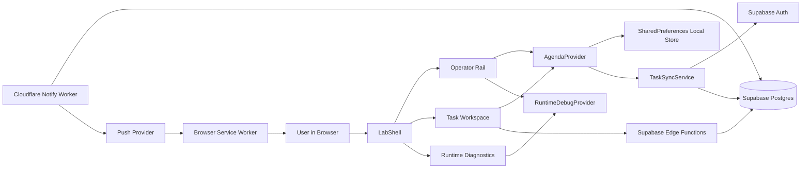

# Architecture - SaaS Reliability Lab

## Purpose

This repository is a web-first reliability lab for studying how a small SaaS behaves when local state, remote state, identity, background work, and push delivery stop lining up perfectly.

The project is no longer organized around a centered task list as its primary artifact.
The active structural direction is a reliability-lab workspace with persistent operator controls and persistent runtime evidence.
The center pane is now a bounded task-workspace canvas with explicit queue and inspector regions on wide screens.

## Architectural principles

### 1. Local-first interaction

The client accepts task writes locally before cloud reconciliation.

Why:

- offline usage must remain possible
- reliability scenarios begin with temporary divergence, not perfect connectivity

### 2. Supabase auth is the source of truth for cloud eligibility

Cached identity exists only as comparison context.

Why:

- local `userId` is convenient for persistence and startup behavior
- cloud behavior must follow the real authenticated session, not the cache

### 3. The sync engine is intentionally transitional

The current sync service is task-based reconciliation, not a durable outbox.

Why:

- the shell needed runtime evidence before a true operation model could be rendered responsibly
- the next backend and data-model step is explicit outbox semantics, not more UI churn

### 4. Runtime evidence must be visible in the product UI

The lab now treats sync, auth, push, and local-state visibility as part of the system, not as optional debug logging.

Why:

- a reliability lab that requires reading console logs is not yet operationally useful
- future experiments need stable UI ownership for diagnostics and controls

### 5. Notification delivery is server-owned

Reminder dispatch runs through backend components rather than interactive client code.

Why:

- scheduled behavior must survive the absence of an active client session
- delivery failure needs its own execution path and lifecycle

### 6. Web-first scope

The lab is currently Flutter Web PWA first.

Why:

- browser service workers and web push are the most mature runtime path in the repository
- the operator-shell redesign is optimized for desktop and wide web layouts first

## High-level topology

## Client shell architecture

### 1. Application bootstrap

Primary files:

- `lib/main.dart`
- `lib/theme/lab_theme.dart`

Responsibilities:

- initialize Supabase
- construct the shared dependency graph
- provide both `AgendaProvider` and `RuntimeDebugProvider`
- launch the lab shell instead of the legacy centered screen

### 2. Root visual shell

Primary file:

- `lib/screens/lab_shell.dart`

Responsibilities:

- cap and center the task workspace within the remaining wide-screen shell space
- own the responsive three-pane layout
- keep the operator rail and diagnostics visible on wide screens
- degrade rails into drawers on narrow screens without changing the core ownership model

### 3. Operator Rail

Primary file:

- `lib/widgets/lab/lab_left_rail.dart`

Responsibilities:

- session and auth actions
- manual sync trigger
- persistent task filters
- anonymous-task review and reconciliation controls
- reserved scenario-control surface for future fault injection

Architectural significance:

This rail is the durable home for controls that used to leak into transient dialogs or the workspace header.

### 4. Task Workspace

Primary file:

- `lib/widgets/lab/task_workspace.dart`

Responsibilities:

- bounded desktop workspace canvas on large screens
- queue controls for search, filter scope, counts, and local session notices
- canonical task queue and selection workflow
- persistent task inspector on desktop and inline inspector on narrower layouts
- create, edit, delete, and completion actions inside the workspace
- auth-state reaction for startup sync, push registration, and anonymous-task decision flow

Architectural significance:

This is now the active center pane.
It is an explicit master/detail workspace rather than a stretched single-column task card.
Browsing stays anchored to the queue while selected-task actions live in the inspector, which removes pressure from the workspace header.
`lib/screens/task_list.dart` remains only as a compatibility wrapper.

### 5. Runtime Diagnostics rail

Primary files:

- `lib/widgets/debug/sync_debug_panel.dart`
- `lib/widgets/debug/debug_status_card.dart`

Responsibilities:

- render connectivity and sync lifecycle state
- show explicit last success, skip, partial, and failure outcomes
- compare session truth with cached identity
- surface local dirty, deleted, and anonymous counts
- render push permission and subscription state
- retain a short runtime event timeline
- reserve future UI slots for queued, sending, acknowledged, failed, and conflict operation states

### 6. Runtime diagnostics model

Primary files:

- `lib/providers/runtime_debug_provider.dart`
- `lib/models/runtime_debug_state.dart`
- `lib/models/runtime_event.dart`

Responsibilities:

- hold the UI-facing diagnostics snapshot
- normalize connectivity, auth, sync, local state, and push state into one renderable model
- publish runtime events that can be inspected in the diagnostics rail

Architectural significance:

The debug rail is now backed by explicit state rather than by ad hoc logs.

## Core application layers

### 1. Local persistence layer

Primary file:

- `lib/repositories/tasks_repository.dart`

Current model:

- SharedPreferences stores the task list under a single key
- task state is serialized as JSON strings

Tradeoff:

- simple and workable for the current prototype
- not strong enough yet for a durable outbox, operation log, or richer local inspection model

### 2. Task model and metadata

Primary file:

- `lib/models/task.dart`

Current role:

- represent task content and local sync metadata
- derive runtime status from time and completion state
- mark account-backed local mutations as dirty or deleted for later reconciliation
- distinguish between anonymous local-only deletes that can be purged immediately and authenticated deletes that must remain tombstoned until sync confirms them

Current limitation:

the model still carries more fidelity than the current sync contract actually transmits, which is one reason the explicit outbox remains the next major structural step

### 3. Provider orchestration

Primary file:

- `lib/providers/agenda_provider.dart`

Responsibilities:

- manage task collection, selection, filter, and search state
- coordinate local persistence and sync triggers
- mirror user identity locally for convenience
- publish task counts into the runtime diagnostics model
- keep all user-facing queue and review counts scoped to active tasks rather than raw tombstones
- prune legacy anonymous deleted tombstones during load so stale local state does not survive upgrades

### 4. Sync engine

Primary file:

- `lib/services/task_sync_service.dart`

Current responsibilities:

- verify connectivity and authenticated session presence
- replay tombstoned deletions for authenticated tasks
- reconcile dirty tasks against remote state
- fetch remote tasks and write back a merged canonical local list
- publish sync outcomes into the runtime diagnostics model

Current reconciliation rule:

- local changes win only when `lastModifiedAt` is newer than the remote timestamp
- otherwise the remote copy replaces the local one

Important constraint:

This is still a task-based reconciliation pass, not a true outbox or per-operation replay protocol.
Because of that, a future archive or trash workflow needs explicit backend lifecycle support instead of a local-only hidden state.

### 5. Session and identity handling

Primary files:

- `lib/services/user_session_service.dart`
- `lib/widgets/bottomsheets/login.dart`
- `lib/widgets/forms/otp_verify_form.dart`

Responsibilities:

- restore and clear cached local identity
- align UI behavior with Supabase auth state
- trigger authenticated startup sync and push registration
- support login, signup, and OTP verification flows

### 6. Push registration and browser runtime

Primary files:

- `lib/helpers/web_push_helper.dart`
- `web/push.js`
- `web/push-sw.js`
- `scripts/merge_sw.sh`
- `scripts/merge_sw.bat`

Responsibilities:

- prime notification permission on web
- register the dedicated browser push service worker
- create and remove browser push subscriptions
- persist subscriptions through backend functions
- surface push state in the diagnostics model

Current deployment model:

- `web/push.js` registers `web/push-sw.js` under a dedicated `/push/` scope
- release builds still ship `flutter_service_worker.js` for Flutter web offline behavior
- `scripts/merge_sw.sh` and `scripts/merge_sw.bat` append the push handler into `flutter_service_worker.js`
- GitHub Pages deployments must also preserve the standalone `push-sw.js` asset because the browser fetches it directly at runtime

### 7. Supabase backend surface

Primary files:

- `@backend/supabase/migrations/*.sql`
- `@backend/supabase/functions/save_subscription/index.ts`
- `@backend/supabase/functions/delete_subscription/index.ts`
- `@backend/supabase/functions/send-push-notifications/index.ts`

Responsibilities:

- store tasks and push subscriptions
- enforce per-user access with RLS
- expose notification-selection RPCs
- save and remove browser subscriptions
- support the on-demand push path for the current authenticated user

### 8. Scheduled notification worker

Primary file:

- `@backend/agenda-notify-worker/src/index.ts`

Responsibilities:

- poll pending notifications every five minutes
- send push payloads to all active subscriptions for the relevant user
- mark tasks as notified after successful provider acceptance
- delete stale subscriptions when providers return `404` or `410`

## State ownership

| Concern | Current source of truth | Notes |
| --- | --- | --- |
| Authenticated session | Supabase auth | Cached `userId` is only a mirror |
| Cached identity | SharedPreferences | UI comparison context only |
| Local task snapshot | SharedPreferences task list | Includes unsynced local mutations |
| Authenticated canonical tasks | Supabase `tasks` table | Pulled back during sync |
| Runtime diagnostics state | `RuntimeDebugProvider` | UI-facing evidence model |
| Push subscription per browser profile | Supabase `push_subscriptions` | One account can have multiple subscriptions |
| Notification dispatch timing | Supabase + Cloudflare Worker cron | Current cadence is every 5 minutes |

## Deployment architecture

### Frontend

- GitHub Actions builds Flutter web
- `--pwa-strategy=offline-first` is used explicitly
- release output is force-pushed to `gh-pages`
- GitHub Pages serves the app from `/saas-reliability-lab/`
- the published artifact includes both `flutter_service_worker.js` and the standalone `push-sw.js`

### Worker

- GitHub Actions deploys the Cloudflare Worker with Wrangler
- cron schedule runs every five minutes

### Environment model

Client-facing values:

- `SUPABASE_URL`
- `SUPABASE_ANON_KEY`
- `VAPID_PUBLIC_KEY`

See `DEPLOYMENT.md` for the current workflow inventory, GitHub Pages branch model, required secrets, and environment matrix.

Server-side values:

- `SUPABASE_SERVICE_ROLE_KEY`
- `VAPID_PRIVATE_KEY`

## What the shell transformation solved

- the app now has durable ownership for operator controls
- runtime evidence is visible without opening logs
- the center pane is clearly the canonical task workspace
- the center pane no longer stretches to absorb all remaining desktop width
- selected-task actions now have a persistent inspector surface instead of crowding the workspace header
- the shell already reserves UI structure for future outbox and conflict surfaces

## What is still missing

- explicit operation outbox semantics
- per-operation acknowledgement, retry, and failure state
- user-visible conflict capture and resolution
- fault-injection controls in the operator rail
- structured logs and metrics beyond the in-app panel

## Planned evolution

The next meaningful phase is deeper system control, not another shell redesign.

Recommended evolution path:

1. introduce a durable outbox instead of implicit dirty-task replay
2. define per-operation states such as queued, sending, acknowledged, failed, and conflict
3. connect those states to the placeholders already reserved in the diagnostics rail
4. add structured logs, metrics, and richer evidence trails
5. add failure injection paths and scenario tooling
6. add audit tables for sync events and notification attempts

## Why this architecture matters

This repository is valuable because it studies a common SaaS boundary that looks simple on paper and becomes messy in production:

- local client state
- shared cloud state
- identity changes
- scheduled backend work
- eventual user-visible convergence

The architecture is intentionally small enough to understand and now structured enough to observe.
The next step is to make its reliability semantics explicit, durable, and testable.