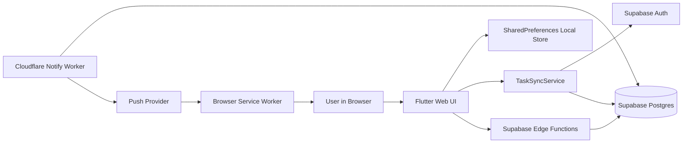
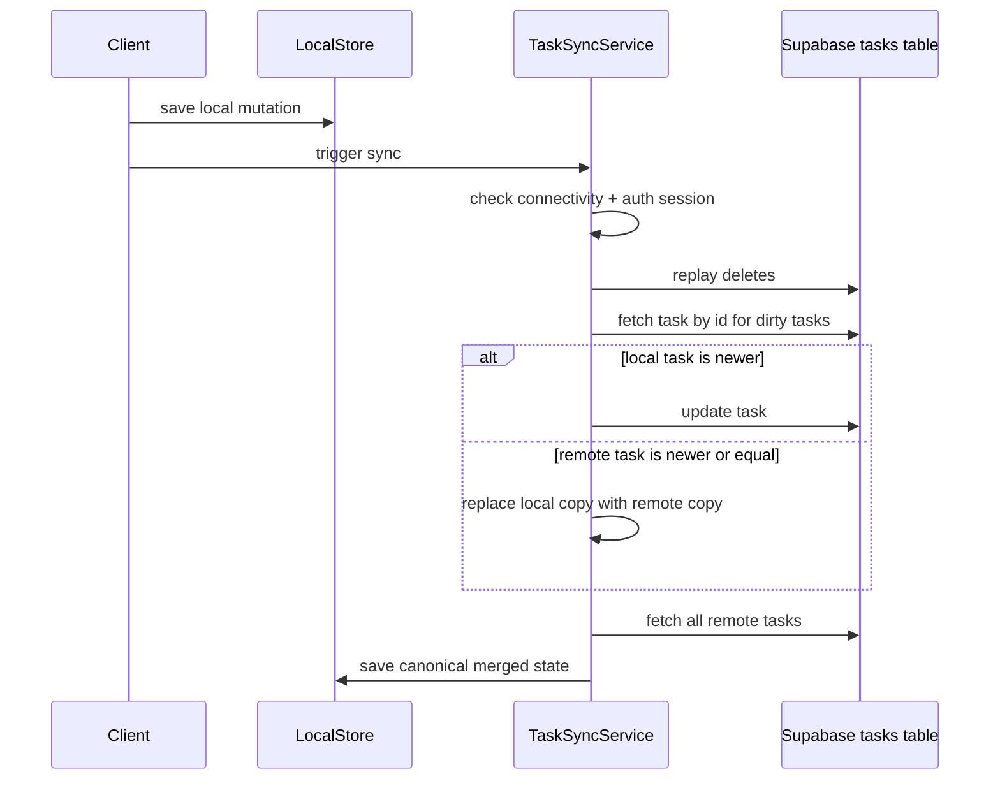
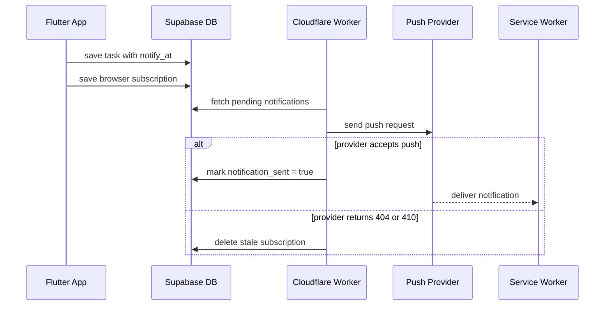

# Architecture - SaaS Reliability Lab

## Purpose

This repository is a web-first reliability lab for studying what happens when a small SaaS system must recover from unreliable clients, delayed synchronization, authentication changes, and background notification delivery.

The project is intentionally not optimized around feature breadth.

The architectural goal is to explore one narrow but realistic operating model:

- users can act while offline
- local state can diverge from remote state temporarily
- identity can appear after local work already exists
- notifications are dispatched by trusted backend infrastructure rather than directly by the client

## Current Architectural Principles

### 1. Local-first interaction

The client accepts task writes locally before cloud reconciliation.

Why:

- offline browsing and local experimentation must remain possible
- reliability scenarios begin with temporary divergence, not perfect connectivity

### 2. Remote state must be able to win safely

The system now prefers the remote copy whenever the local copy is not provably newer.

Why:

- silent stale-local overwrite is more dangerous than explicit remote preference
- a reliability lab needs deterministic reconciliation rules before it can study conflict handling more deeply

### 3. Authentication is the source of truth for cloud behavior

The client does not treat a cached local `userId` as authoritative.

Why:

- cached identity is only a convenience for UI and local persistence
- session truth belongs to Supabase auth state

### 4. Notification delivery is server-owned

Reminder dispatch runs through backend components.

Why:

- push delivery should not depend on an interactive client session
- the lab needs a background execution path that can fail independently

### 5. Web-first scope

The lab is currently a Flutter Web PWA first.

Why:

- browser service workers and web push are the most mature runtime path in the current repository
- mobile and desktop scaffolding exists, but the reliability-specific behavior is not yet implemented there

## High-Level System Topology

## Component Breakdown

## 1. Flutter client

Primary files:

- `lib/main.dart`
- `lib/screens/task_list.dart`
- `lib/providers/agenda_provider.dart`

Responsibilities:

- initialize Supabase and the app dependency graph
- render the task list and task editing interactions
- manage authenticated vs anonymous behavior
- trigger sync and push registration on auth events

### UI surface currently implemented

- create task
- edit task
- delete task
- toggle completion
- search tasks
- filter tasks
- login / signup / OTP verification
- anonymous-task adoption or discard after login

## 2. Local persistence layer

Primary file:

- `lib/repositories/tasks_repository.dart`

Storage model:

- SharedPreferences under a single `tasks` key
- task list serialized as JSON strings

Current tradeoff:

- simple and good enough for a small offline prototype
- not yet suitable for a full outbox, event log, or large local dataset

## 3. Task model and local metadata

Primary file:

- `lib/models/task.dart`

Domain data:

- title, start time, duration, completion state, priority, description, tags

Sync data:

- `syncStatus`
- `lastModifiedAt`
- `createdAt`
- `updatedAt`
- `userId`

Important current behavior:

- the model derives `status` dynamically from time and completion state
- local mutations call `dirty()` or `markAsDeleted()` to participate in sync

## 4. Sync engine

Primary file:

- `lib/services/task_sync_service.dart`

Current responsibilities:

- verify connectivity
- require an authenticated session before cloud sync
- replay local deletions
- reconcile local dirty tasks with remote state
- fetch the remote canonical task set
- preserve only unsynced local tasks that still need future replay

Current reconciliation rule:

- local update wins only when `lastModifiedAt` is newer than the remote task timestamp
- otherwise the remote copy replaces the local one

This is still a lightweight reconciliation pass, not yet a full durable outbox protocol.

### Current sync lifecycle

## 5. Session and identity handling

Primary files:

- `lib/services/user_session_service.dart`
- `lib/widgets/bottomsheets/login.dart`
- `lib/widgets/forms/otp_verify_form.dart`

Responsibilities:

- derive cloud eligibility from Supabase auth state
- mirror user id locally for convenience only
- load existing authenticated sessions on startup
- clear stale local identity when no active session exists

Important current behavior:

- startup sync is explicitly triggered for restored sessions
- logout clears local tasks and attempts bounded push cleanup

## 6. Push registration and browser runtime

Primary files:

- `lib/helpers/web_push_helper.dart`
- `web/push.js`
- `web/push-sw.js`
- `scripts/merge_sw.sh`
- `scripts/merge_sw.bat`

Responsibilities:

- request notification permission
- register the browser service worker
- create and remove web push subscriptions
- persist subscriptions through backend functions
- display notifications inside the browser service worker

Important deployment detail:

- custom push logic is merged into Flutter's generated release service worker during build

## 7. Supabase backend surface

Primary files:

- `@backend/supabase/migrations/*.sql`
- `@backend/supabase/functions/save_subscription/index.ts`
- `@backend/supabase/functions/delete_subscription/index.ts`
- `@backend/supabase/functions/send-push-notifications/index.ts`

Responsibilities:

- store tasks and push subscriptions
- enforce per-user access through RLS
- provide notification-selection RPCs
- save and remove browser subscriptions
- support on-demand push dispatch for the current user

Current database entities:

- `tasks`
- `push_subscriptions`

Current RPCs:

- `get_pending_notifications(now)`
- `get_my_pending_notifications(now)`

## 8. Scheduled notification worker

Primary file:

- `@backend/agenda-notify-worker/src/index.ts`

Responsibilities:

- poll pending notifications every 5 minutes
- send push payloads to each active subscription
- mark tasks as notified after successful provider acceptance
- remove stale subscriptions on `404` or `410`

Current semantics:

- best-effort scheduled delivery
- stale subscription cleanup is implemented
- there is no separate delivery-attempt table yet

### Current notification flow

## State Ownership

| Concern | Current source of truth | Notes |
| --- | --- | --- |
| Authenticated session | Supabase auth | Local `userId` is only a mirror |
| Anonymous task state | Local SharedPreferences | Exists before login |
| Authenticated canonical task state | Supabase `tasks` table | Pulled back during sync |
| Local unsynced mutations | SharedPreferences task list | Not yet a separate outbox |
| Push subscription per browser profile | Supabase `push_subscriptions` | One account can have multiple subscriptions |
| Notification dispatch timing | Supabase + Cloudflare Worker cron | Current cadence is every 5 minutes |

## Deployment Architecture

## Frontend

- GitHub Actions builds Flutter web
- `--pwa-strategy=offline-first` is used explicitly
- release build is published to GitHub Pages

## Worker

- GitHub Actions deploys the Cloudflare Worker with Wrangler
- cron schedule runs every 5 minutes

## Environment model

Client-facing values:

- `SUPABASE_URL`
- `SUPABASE_ANON_KEY`
- `VAPID_PUBLIC_KEY`

Server-side values:

- `SUPABASE_SERVICE_ROLE_KEY` or worker service-role secret
- `VAPID_PRIVATE_KEY`

## Current Constraints

The architecture is intentionally small, but it still has important gaps.

### What it does well today

- demonstrates local-first task state
- demonstrates authenticated sync and backend ownership
- demonstrates scheduled web-push delivery
- demonstrates stale subscription cleanup

### What it does not yet do well

- durable operation outbox
- explicit retry and backoff policy
- conflict visibility and resolution
- structured observability
- repeatable experiment toggles
- broad automated coverage

## Planned Architectural Evolution

The next meaningful phase is not more UI. It is deeper system control.

Recommended evolution path:

1. introduce a durable outbox instead of implicit dirty-object sync
2. add explicit conflict state and conflict visibility
3. add structured logs, metrics, and a debug surface
4. add failure injection paths and scenario scripts
5. add audit tables for sync events and notification attempts

## Why this architecture matters

This repository is valuable because it studies a common SaaS boundary that looks simple on paper and becomes messy in production:

- local client state
- shared cloud state
- identity changes
- scheduled backend work
- eventual user-visible convergence

The architecture is intentionally small enough to understand, but rich enough to reproduce the kinds of inconsistencies that appear once real users start behaving like real users.