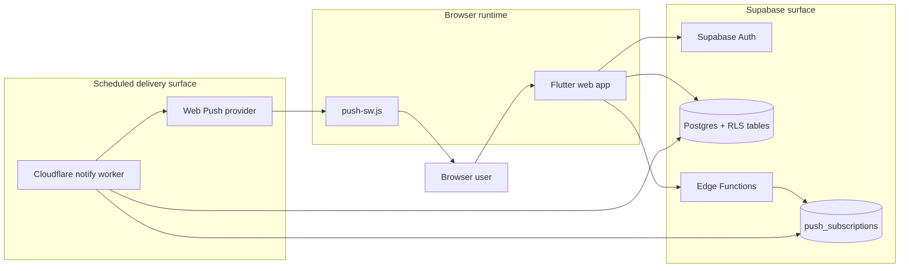
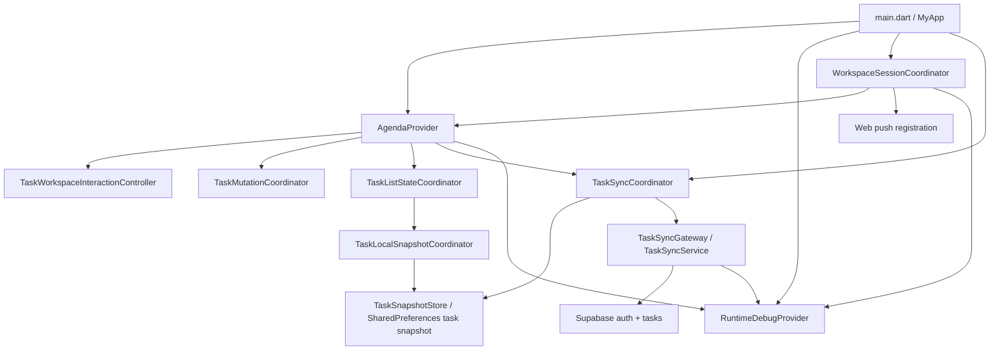
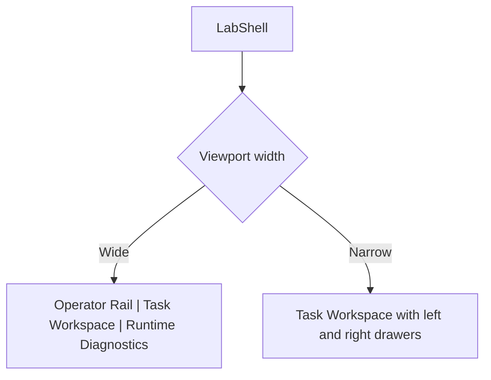
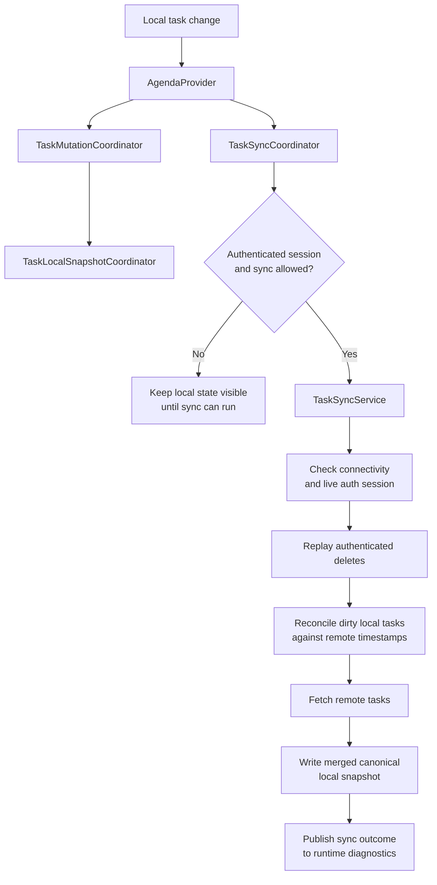
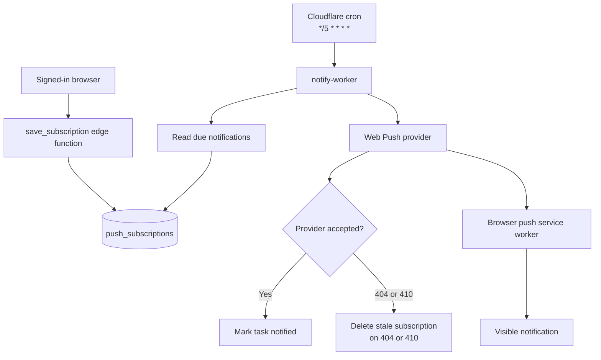
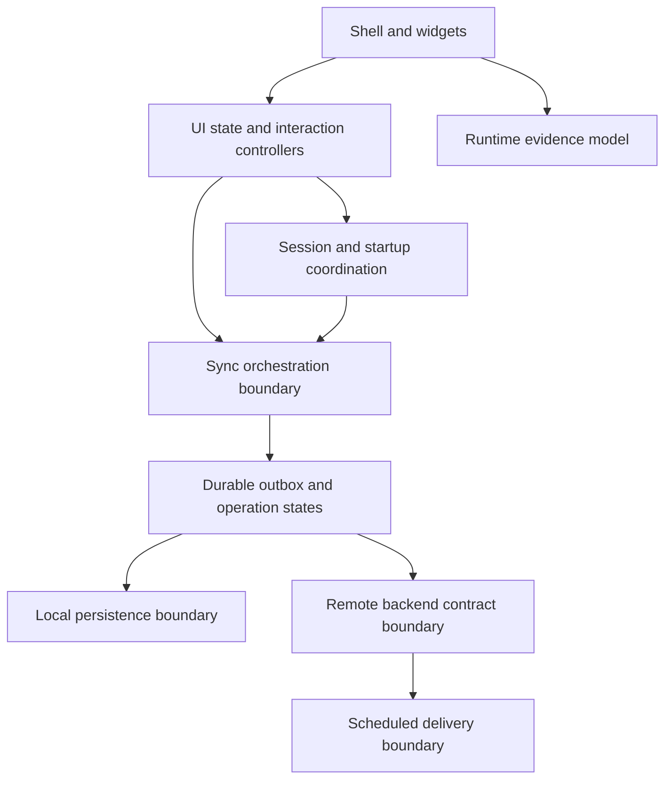

# Architecture - SaaS Reliability Lab

## Purpose

This repository is a web-first reliability lab for studying how a small SaaS behaves when local state, remote state, identity, background work, and push delivery stop lining up perfectly.

The project is no longer organized around a centered task list as its primary artifact.
The active structural direction is a reliability-lab workspace with persistent operator controls and persistent runtime evidence.
The center pane is now a bounded task-workspace canvas with explicit queue and inspector regions on wide screens.

## Architectural principles

### 1. Local-first interaction

The client accepts task writes locally before cloud reconciliation.

Why:

- offline usage must remain possible
- reliability scenarios begin with temporary divergence, not perfect connectivity

### 2. Supabase auth is the source of truth for cloud eligibility

Cached identity exists only as comparison context.

Why:

- local `userId` is convenient for persistence and startup behavior
- cloud behavior must follow the real authenticated session, not the cache

### 3. The sync engine is intentionally transitional

The current sync service now supports an explicit outbox replay path, but the overall sync boundary is still transitional.

Why:

- the shell needed runtime evidence before a true operation model could be rendered responsibly
- the first Objective 1 slice prioritizes honest local operation state before a stronger backend mutation boundary or stronger local durability

Current implication:

- the implemented delayed-sync scenario is currently a client-owned pre-replay hold, not a true transport-latency or backend-acknowledgement delay
- explicit outbox replay now exists when the runtime is using the coordinated local task-plus-outbox state layer
- failed, blocked, conflict, queued, sending, and recent acknowledgement evidence now surface through runtime diagnostics and workspace notices
- recent acknowledgements are currently retained as a rolling local history of up to 10 entries, and the diagnostics rail exposes a manual clear action for clean recording or demo setup
- the diagnostics rail also exposes a soft demo reset action that clears transient diagnostics history, retained acknowledgements, sync outcome surfaces, and fault-injection UI state while preserving auth state, push state truth, local tasks, and active outbox entries
- the diagnostics rail also exposes a hard reset action that confirms the remote deletion replay for authenticated remote-backed tasks before wiping all local task and outbox state on the current device
- older task-shaped sync seams still exist as a fallback path for flows that are not yet running through the coordinated outbox state layer

Current Objective 1 implication:

- the repository now uses an explicit two-layer state-machine model for the first outbox slice:
  - a per-operation outbox state machine for queued, sending, acknowledged, failed, blocked, and conflict states
  - a higher-level sync-run state machine for runtime phases such as idle, syncing, offline, blocked-on-session, blocked-on-anonymous-review, and error
- the operation-state machine currently owns replay only on the client-side direct CRUD path; first-slice conflict resolution is implemented, sign-out still clears the local workspace boundary, and stronger durability remains a later step

### 4. Runtime evidence must be visible in the product UI

The lab now treats sync, auth, push, and local-state visibility as part of the system, not as optional debug logging.

Why:

- a reliability lab that requires reading console logs is not yet operationally useful
- future experiments need stable UI ownership for diagnostics and controls

### 5. Notification delivery is server-owned

Reminder dispatch runs through backend components rather than interactive client code.

Why:

- scheduled behavior must survive the absence of an active client session
- delivery failure needs its own execution path and lifecycle

### 6. Web-first scope

The lab is currently Flutter Web PWA first.

Why:

- browser service workers and web push are the most mature runtime path in the repository
- the operator-shell redesign is optimized for desktop and wide web layouts first

## High-level topology

Read the architecture in three separate views:

1. the **implemented system context** across browser, Supabase, and scheduled delivery
2. the **implemented browser runtime seams** inside the Flutter app
3. the **UI shell layout**, which is documented later in this file instead of being folded into the system diagrams

## Client shell architecture

### 1. Application bootstrap

Primary files:

- `lib/main.dart`
- `lib/theme/lab_theme.dart`
- `lib/services/workspace_session_coordinator.dart`
- `lib/services/task_sync_coordinator.dart`
- `lib/services/task_list_state_coordinator.dart`

Responsibilities:

- initialize Supabase
- construct the shared dependency graph
- construct the current task-list state, snapshot, and sync boundaries explicitly before wiring `AgendaProvider`
- provide `AgendaProvider`, `RuntimeDebugProvider`, and the coordination seams that sit between workspace widgets and lower-level services
- launch the lab shell instead of the legacy centered screen

### 2. Root visual shell

Primary file:

- `lib/screens/lab_shell.dart`

UI layout belongs here, not in the system-topology diagrams above.

Responsibilities:

- cap and center the task workspace within the remaining wide-screen shell space
- own the responsive three-pane layout
- keep the operator rail and diagnostics visible on wide screens
- degrade rails into drawers on narrow screens without changing the core ownership model

### 3. Operator Rail

Primary file:

- `lib/widgets/lab/lab_left_rail.dart`

Responsibilities:

- session and auth actions
- manual sync trigger
- persistent task filters
- anonymous-task review and reconciliation controls
- active scenario-control surface for connectivity-loss and delayed-sync injection, with the same rail reserved for later auth-expiry and replay scenarios

Architectural significance:

This rail is the durable home for controls that used to leak into transient dialogs or the workspace header.

### 4. Task Workspace

Primary file:

- `lib/widgets/lab/task_workspace.dart`

Responsibilities:

- bounded desktop workspace canvas on large screens
- queue controls for search, filter scope, counts, and local session notices
- canonical task queue and selection workflow
- persistent task inspector on desktop and inline inspector on narrower layouts
- create, edit, delete, and completion actions inside the workspace
- delegate startup and auth-session flow to `WorkspaceSessionCoordinator`

Architectural significance:

This is now the active center pane.
It is an explicit master/detail workspace rather than a stretched single-column task card.
Browsing stays anchored to the queue while selected-task actions live in the inspector, which removes pressure from the workspace header.
`lib/screens/task_list.dart` remains only as a compatibility wrapper.

### 5. Runtime Diagnostics rail

Primary files:

- `lib/widgets/debug/sync_debug_panel.dart`
- `lib/widgets/debug/debug_status_card.dart`

Responsibilities:

- render connectivity and sync lifecycle state
- show explicit last success, skip, partial, and failure outcomes
- compare session truth with cached identity
- surface local dirty, deleted, and anonymous counts
- render push permission and subscription state
- retain a short runtime event timeline with expandable operator records for stage, task-level evidence, and state diffs
- reserve future UI slots for queued, sending, acknowledged, failed, and conflict operation states

### 6. Runtime diagnostics model

Primary files:

- `lib/providers/runtime_debug_provider.dart`
- `lib/models/runtime_debug_state.dart`
- `lib/models/runtime_event.dart`

Responsibilities:

- hold the UI-facing diagnostics snapshot
- normalize connectivity, auth, sync, local state, and push state into one renderable model
- publish runtime events that can be inspected in the diagnostics rail, including structured sync evidence when task-level context is available

Architectural significance:

The debug rail is now backed by explicit state rather than by ad hoc logs.

### 7. Local snapshot boundary

Primary files:

- `lib/repositories/tasks_repository.dart`
- `lib/services/task_local_snapshot_coordinator.dart`

Responsibilities:

- keep the current local task snapshot readable and writable
- prune legacy deleted anonymous tombstones from the persisted snapshot
- isolate the current snapshot-storage meaning from future local-state concerns such as an outbox or richer inspection model

Architectural significance:

The app still uses SharedPreferences for local task storage, but the code now treats that as the implementation of a task snapshot boundary rather than as the long-term meaning of local persistence.

### 8. Sync boundary

Primary files:

- `lib/services/task_sync_service.dart`
- `lib/services/task_sync_coordinator.dart`

Responsibilities:

- expose an app-facing sync gateway contract
- keep the current task-level reconciliation engine behind that contract
- normalize sync entry and reload behavior through `TaskSyncCoordinator`
- keep runtime evidence wired to explicit sync outcomes while the underlying implementation remains transitional

Architectural significance:

The current sync engine is still task-based, but the rest of the app no longer needs to depend directly on the concrete service shape to start or reload a sync pass.
Objective 1 is the step that turns this seam into a true state-machine boundary instead of only a task-pass orchestration seam.

### 9. Current backend contract boundary

Primary files:

- `lib/services/task_sync_service.dart`
- `lib/helpers/web_push_helper_web.dart`
- `supabase/functions/save_subscription/index.ts`
- `supabase/functions/delete_subscription/index.ts`
- `supabase/migrations/*.sql`

Responsibilities:

- keep the current task sync path explicit as direct `tasks` table CRUD through the Supabase client
- keep push subscription save and delete flows behind backend-owned Edge Functions
- expose worker-facing pending-notification selection through a small RPC surface

Current boundary:

- the app-side sync gateway is `TaskSyncGateway`, implemented today by `TaskSyncService`
- the backend-side task sync contract is still direct table access on `tasks`, not a dedicated RPC or Edge Function mutation gateway
- push subscription management already uses a different backend contract on purpose

Architectural significance:

Objective 0 now has a clearer frontend-facing sync boundary, but the long-term backend mutation surface is still intentionally undecided. The repository should describe that as a transitional contract rather than pretending the final backend shape already exists.

The planned Objective 1 state machine therefore starts on the client side first.
The client will model explicit operation states before the repository commits to a server-owned mutation gateway or stronger backend idempotency contract.

### 10. Scheduled delivery boundary

Primary files:

- `notify-worker/src/index.ts`
- `supabase/migrations/20250627024942_get_pending_notification_function.sql`
- `supabase/functions/save_subscription/index.ts`
- `supabase/functions/delete_subscription/index.ts`

Responsibilities:

- fetch due notifications through the `get_pending_notifications` RPC
- send web push payloads from the worker runtime
- mark successful sends by updating `tasks.notification_sent`
- clean up stale rows in `push_subscriptions`

Architectural significance:

The notify worker is a separate scheduled delivery surface, not a hidden extension of the interactive client. The frontend does not own delivery timing and does not call the worker directly.

## Core application layers

### 1. Local persistence layer

Primary files:

- `lib/repositories/tasks_repository.dart`
- `lib/services/task_local_snapshot_coordinator.dart`

Current model:

- SharedPreferences stores the task list under a single key
- task state is serialized as JSON strings

Tradeoff:

- simple and workable for the current prototype
- not strong enough yet for a durable outbox, operation log, or richer local inspection model

Current boundary:

- `TasksRepository` still owns the raw SharedPreferences storage contract
- `TaskLocalSnapshotCoordinator` now owns snapshot load, save, removal, clear, and legacy anonymous-tombstone pruning around that repository

### 2. Task model and metadata

Primary file:

- `lib/models/task.dart`

Current role:

- represent task content and local sync metadata
- derive runtime status from time and completion state
- mark account-backed local mutations as dirty or deleted for later reconciliation
- distinguish between anonymous local-only deletes that can be purged immediately and authenticated deletes that must remain tombstoned until sync confirms them

Current limitation:

the model still carries more fidelity than the current sync contract actually transmits, which is one reason the explicit outbox remains the next major structural step

### 3. Provider orchestration

Primary file:

- `lib/providers/agenda_provider.dart`
- `lib/controllers/task_workspace_interaction_controller.dart`
- `lib/services/task_list_state_coordinator.dart`
- `lib/services/task_sync_flow_coordinator.dart`

Responsibilities:

- manage task collection and workspace-facing task intents
- delegate selection, search, filter, sort, batch-mode, and interaction-pruning rules to `TaskWorkspaceInteractionController`
- coordinate local persistence and workspace-facing task intents
- mirror the current user identity locally for convenience
- publish task counts into the runtime diagnostics model
- keep all user-facing queue and review counts scoped to active tasks rather than raw tombstones
- prune legacy anonymous deleted tombstones during load so stale local state does not survive upgrades

Current boundary:

- `AgendaProvider` no longer owns sync gating, post-sync reload, or startup/auth session flow
- `AgendaProvider` also no longer owns raw snapshot load/save/remove/clear orchestration or direct task-count publication against the runtime diagnostics model
- `AgendaProvider` also no longer owns the task-list mutation rules for completion, deletion, and anonymous-task adoption
- `AgendaProvider` also no longer owns most provider-facing sync sequencing around mutation save, anonymous-task review, and sync-trigger choreography
- `AgendaProvider` also no longer owns the direct view-reset and selection-pruning rules for workspace interaction state
- `TaskWorkspaceInteractionController` now composes `TaskFilterController` and `TaskSelectionController` with explicit batch-mode rules so queue state can evolve without further inflating the provider
- `TaskLocalSnapshotCoordinator` now owns the local snapshot orchestration seam around `TasksRepository`
- `TaskListStateCoordinator` now owns the provider-facing local task-list load/save/remove/clear path together with task-count publication into `RuntimeDebugProvider`
- `TaskMutationCoordinator` now owns task-list mutation rules while leaving persistence and sync triggering to the provider
- `TaskSyncFlowCoordinator` now owns the provider-facing sequencing around persisted mutation results, anonymous-task keep/discard flows, and sync-trigger handoff into `TaskSyncCoordinator`
- `TaskSyncCoordinator` now owns sync-entry checks and reload wiring around `TaskSyncService`
- `WorkspaceSessionCoordinator` now owns startup/session bootstrap, auth reactions, and push-registration sequencing

### 4. Sync coordination

Primary file:

- `lib/services/task_sync_coordinator.dart`

Responsibilities:

- gate sync attempts on authenticated user context and anonymous-task review state
- bridge `AgendaProvider` task intents to the remote sync engine
- reload the local snapshot after sync so the provider can stay focused on workspace state

Important constraint:

This is an orchestration seam, not the remote contract itself.
The task-based reconciliation logic still lives in `TaskSyncService`.

### 5. Sync engine

Primary file:

- `lib/services/task_sync_service.dart`

Current responsibilities:

- verify connectivity and authenticated session presence
- replay tombstoned deletions for authenticated tasks
- reconcile dirty tasks against remote state
- fetch remote tasks and write back a merged canonical local list
- publish sync outcomes into the runtime diagnostics model

Current reconciliation rule:

- local changes win only when `lastModifiedAt` is newer than the remote timestamp
- otherwise the remote copy replaces the local one

Backend timestamp requirement:

- this rule depends on the remote `tasks.updated_at` value being refreshed on every task update
- the Supabase schema now maintains that timestamp with a database trigger so the client-side comparison is not relying on insert-time defaults alone

Important constraint:

This is still a task-based reconciliation pass, not a true outbox or per-operation replay protocol.
Because of that, a future archive or trash workflow needs explicit backend lifecycle support instead of a local-only hidden state.

Current implemented sync pass:

### 6. Session and identity handling

Primary files:

- `lib/services/workspace_session_coordinator.dart`
- `lib/services/user_session_service.dart`
- `lib/widgets/bottomsheets/login.dart`
- `lib/widgets/forms/otp_verify_form.dart`

Responsibilities:

- restore and clear cached local identity
- align workspace behavior with Supabase auth state
- trigger authenticated startup sync and push registration through a dedicated coordinator
- support login, signup, and OTP verification flows

### 7. Push registration and browser runtime

Primary files:

- `lib/helpers/web_push_helper.dart`
- `flutter-app/web/push.js`
- `flutter-app/web/push-sw.js`
- `flutter-app/scripts/merge_sw.sh`
- `flutter-app/scripts/merge_sw.bat`

Responsibilities:

- prime notification permission on web
- register the dedicated browser push service worker
- create and remove browser push subscriptions
- persist subscriptions through backend functions
- surface push state in the diagnostics model

Current deployment model:

- `flutter-app/web/push.js` registers `flutter-app/web/push-sw.js` under a dedicated `/push/` scope
- release builds still ship `flutter_service_worker.js` for Flutter web offline behavior
- `flutter-app/scripts/merge_sw.sh` and `flutter-app/scripts/merge_sw.bat` append the push handler into `flutter_service_worker.js`
- GitHub Pages deployments must also preserve the standalone `push-sw.js` asset because the browser fetches it directly at runtime

### 8. Supabase backend surface

Primary files:

- `supabase/migrations/*.sql`
- `supabase/functions/save_subscription/index.ts`
- `supabase/functions/delete_subscription/index.ts`
- `supabase/functions/send-push-notifications/index.ts`

Responsibilities:

- store tasks and push subscriptions
- enforce per-user access with RLS
- expose notification-selection RPCs
- save and remove browser subscriptions
- support the on-demand push path for the current authenticated user

### 9. Scheduled notification worker

Primary file:

- `notify-worker/src/index.ts`

Responsibilities:

- poll pending notifications every five minutes
- send push payloads to all active subscriptions for the relevant user
- mark tasks as notified after successful provider acceptance
- delete stale subscriptions when providers return `404` or `410`

Current notification path:

## State ownership

| Concern                               | Current source of truth           | Notes                                       |
| ------------------------------------- | --------------------------------- | ------------------------------------------- |
| Authenticated session                 | Supabase auth                     | Cached `userId` is only a mirror            |
| Cached identity                       | SharedPreferences                 | UI comparison context only                  |
| Local task snapshot                   | SharedPreferences task list       | Includes unsynced local mutations           |
| Authenticated canonical tasks         | Supabase `tasks` table            | Pulled back during sync                     |
| Runtime diagnostics state             | `RuntimeDebugProvider`            | UI-facing evidence model                    |
| Push subscription per browser profile | Supabase `push_subscriptions`     | One account can have multiple subscriptions |
| Notification dispatch timing          | Supabase + Cloudflare Worker cron | Current cadence is every 5 minutes          |

## Deployment architecture

### Frontend

- GitHub Actions builds Flutter web
- release output is force-pushed to `gh-pages`
- GitHub Pages serves the app from `/saas-reliability-lab/`
- the published artifact includes both `flutter_service_worker.js` and the standalone `push-sw.js`

### Worker

- GitHub Actions deploys the Cloudflare Worker with Wrangler
- cron schedule runs every five minutes

### Environment model

Client-facing values:

- `SUPABASE_URL`
- `SUPABASE_ANON_KEY`
- `VAPID_PUBLIC_KEY`

See `docs/DEPLOYMENT.md` for the current workflow inventory, GitHub Pages branch model, required secrets, and environment matrix.

Server-side values:

- `SUPABASE_SERVICE_ROLE_KEY`
- `VAPID_PRIVATE_KEY`

## What the shell transformation solved

- the app now has durable ownership for operator controls
- runtime evidence is visible without opening logs
- the center pane is clearly the canonical task workspace
- the center pane no longer stretches to absorb all remaining desktop width
- selected-task actions now have a persistent inspector surface instead of crowding the workspace header
- the shell already reserves UI structure for future outbox and conflict surfaces

## What is still missing

- explicit operation outbox semantics
- per-operation acknowledgement, retry, and failure state
- user-visible conflict capture and resolution
- fault-injection controls in the operator rail
- structured logs and metrics beyond the in-app panel

## Planned evolution

The next meaningful phase is deeper system control, not another shell redesign.
The following diagram is a **target boundary map**, not a claim that these seams are fully implemented today.

Recommended evolution path:

1. refactor the system foundation toward clearer boundaries between shell state, session coordination, sync orchestration, local persistence, backend contract, runtime evidence, and scheduled delivery
2. introduce a durable outbox instead of implicit dirty-task replay
3. define per-operation states such as queued, sending, acknowledged, failed, and conflict
4. connect those states to the placeholders already reserved in the diagnostics rail
5. add structured logs, metrics, and richer evidence trails
6. add failure injection paths and scenario tooling
7. add audit tables for sync events and notification attempts

See `OBJECTIVE_0_FOUNDATION_PLAN.md` for the concrete plan that now sits in front of outbox work.

## Why this architecture matters

This repository is valuable because it studies a common SaaS boundary that looks simple on paper and becomes messy in production:

- local client state
- shared cloud state
- identity changes
- scheduled backend work
- eventual user-visible convergence

The architecture is intentionally small enough to understand and now structured enough to observe.
The next step is to clean up the foundation so its reliability semantics can later become explicit, durable, and testable on stronger seams.
