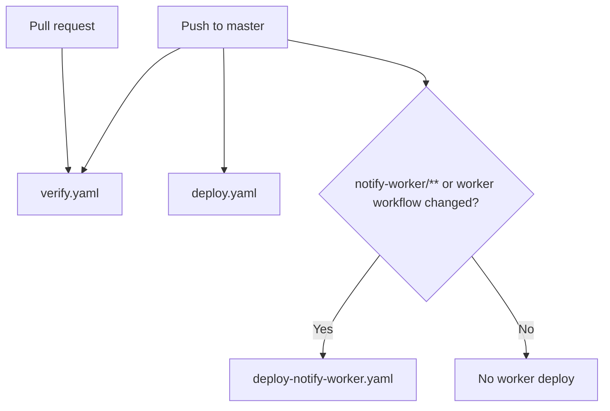
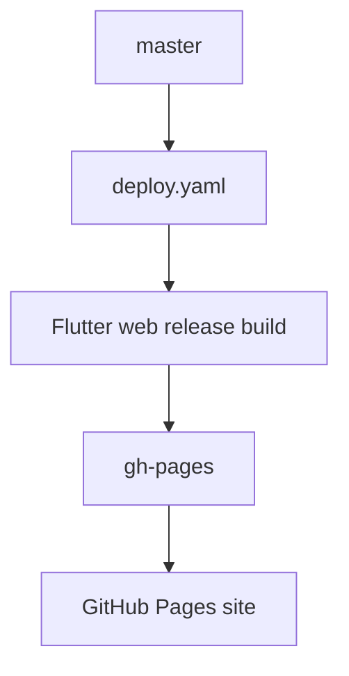

# Deployment and CI

## Purpose

This document describes the deployment contract that currently exists in the repository.
It focuses on the implemented GitHub Actions workflows, GitHub Pages integration, Cloudflare Worker deployment, and the environment values each runtime expects.

The goal is operational clarity.
This repository is a reliability lab, so deployment behavior needs to be explicit rather than hidden inside workflow files.

## Workflow inventory

### 1. Frontend deploy

Primary files:

- `.github/workflows/deploy.yaml`
- `.github/actions/build-and-deploy-action/action.yaml`

Trigger:

- every push to `master`

What it does:

- checks out the repository
- installs Flutter `3.41.5` on `stable`
- builds Flutter web in release mode
- uses the GitHub Pages base href `/saas-reliability-lab/`
- injects client-facing runtime values through `--dart-define`
- merges `web/push-sw.js` into `build/web/flutter_service_worker.js`
- keeps the standalone `build/web/push-sw.js` asset for the dedicated push-worker scope
- force-pushes the contents of `build/web` to `gh-pages`

Operational expectations:

- GitHub Pages must publish from the `gh-pages` branch
- the deployed site root must remain `/saas-reliability-lab/`
- the release artifact must include both `flutter_service_worker.js` and `push-sw.js`

### 2. Scheduled notify worker deploy

Primary files:

- `.github/workflows/deploy-notify-worker.yaml`
- `notify-worker/wrangler.jsonc`

Trigger:

- push to `master` when files under `notify-worker/**` change
- push to `master` when `.github/workflows/deploy-notify-worker.yaml` changes
- manual `workflow_dispatch`

What it does:

- checks out the repository
- installs Node.js `20`
- enables Corepack
- installs the worker dependencies with Yarn
- deploys the worker through Wrangler

Operational expectations:

- the worker cron remains `*/5 * * * *`
- the worker deployment is independent from the frontend deployment
- frontend-only pushes do not redeploy the worker

### 3. Repository verification

Primary file:

- `.github/workflows/verify.yaml`

Trigger:

- every pull request
- every push to `master`
- manual `workflow_dispatch`

What it does:

- checks out the repository
- runs Flutter tests from `flutter-app\`
- runs worker tests from `notify-worker\`
- verifies repository correctness without deploying anything

Operational expectations:

- verification remains separate from deployment concerns
- test failures should block trust in the current branch even when deploy workflows have not run
- new reliability-critical suites should be added here as they become part of the repo contract

## Current workflow orchestration

On pushes to `master`, the repository currently uses **parallel workflow triggering**, not a gated deploy chain.

Manual trigger behavior is narrower than the push path:

- `verify.yaml` can also be started with `workflow_dispatch`
- `deploy-notify-worker.yaml` can also be started with `workflow_dispatch`
- `deploy.yaml` does **not** currently expose a manual trigger

What that means in practice:

- `verify.yaml` starts on every push to `master`
- `deploy.yaml` also starts on every push to `master`
- `deploy-notify-worker.yaml` starts on the same push when its path filters match
- none of those workflows currently wait for one another

So yes: the current setup allows deploy jobs to run in parallel with repository verification.
That is not accidental in the workflow files.
It is the result of keeping:

- repository verification as its own workflow
- frontend deployment as its own workflow
- worker deployment as its own workflow

### Why the repo is currently set up this way

For the current shape of this project, the split has some real advantages:

- the public GitHub Pages demo updates quickly after a merge to `master`
- the Cloudflare worker can remain deployable on its own instead of being coupled to every frontend change
- repository trust and deployment behavior are documented as separate concerns, which fits the reliability-lab framing

This is a reasonable **transitional** setup for a small monorepo with one public demo surface and one separately deployable scheduled worker.
It keeps automation simple while the product, tests, and backend contract are still evolving.

### Tradeoffs of the current parallel model

This setup also has an important cost:

- a deploy can finish before `verify.yaml` reports a failure
- `master` is acting as both the integration branch and the deployment trigger
- a broken post-merge state can become public briefly even though verification later reports that the commit should not be trusted

For a reliability-lab repository, that tradeoff is understandable in the short term, but it should be read as a speed-vs-safety compromise, not as the ideal long-term CI/CD model.

## GitHub Pages integration

### Branch and publish model

- source branch: `master`
- deploy branch: `gh-pages`
- publish path: repository root on `gh-pages`
- public URL: `https://eliasfeijo.github.io/saas-reliability-lab/`

The frontend workflow does not use Pages artifacts or the dedicated `actions/deploy-pages` flow.
It builds the app and force-pushes the generated web output directly to `gh-pages`.

That means:

- `gh-pages` is treated as generated output only
- manual edits on `gh-pages` are expected to be overwritten
- the workflow is the source of truth for deploy behavior

### Base href contract

The app is built with:

- `--base-href /saas-reliability-lab/`

This is required because the app is served from a project subpath instead of the site root.

The following runtime paths depend on that base href being correct:

- `flutter_bootstrap.js`
- `flutter_service_worker.js`
- `push-sw.js`
- web icons and manifest paths

If the GitHub Pages repository name or publish path changes, the base href must change with it.

### Service worker model in production

The current production build intentionally publishes two service-worker-related assets:

- `flutter_service_worker.js`
- `push-sw.js`

They serve different purposes.

`flutter_service_worker.js`:

- is the Flutter web release service worker
- also receives the merged push handler content from `web/push-sw.js`

`push-sw.js`:

- is published as a standalone asset
- is registered by `web/push.js` under the dedicated scope `/saas-reliability-lab/push/`
- isolates browser push registration from the main Flutter app service worker lifecycle

This split matters because the lab now uses a dedicated push-worker scope for browser push subscriptions instead of relying on the root Flutter service worker registration.

## Required secrets

### Frontend workflow secrets

Used by `.github/workflows/deploy.yaml`:

- `SUPABASE_URL`
- `SUPABASE_ANON_KEY`
- `VAPID_PUBLIC_KEY`

These values are injected into the compiled Flutter web app through `--dart-define`.
They are client-visible by design and must not contain server-only secrets.

### Worker workflow secrets

Used by `.github/workflows/deploy-notify-worker.yaml` and the deployed worker environment:

- `CLOUDFLARE_API_TOKEN`
- `CLOUDFLARE_ACCOUNT_ID`

The worker itself also expects runtime secrets or environment variables for:

- `SUPABASE_URL`
- `SUPABASE_SERVICE_ROLE`
- `VAPID_PUBLIC_KEY`
- `VAPID_PRIVATE_KEY`

Those are configured in Cloudflare, not in the frontend deploy workflow.

## Environment matrix

| Environment | Frontend host | Frontend config source | Push worker path | Backend target | Worker runtime |
| --- | --- | --- | --- | --- | --- |
| Local Flutter web run | `http://localhost:<port>/` | `flutter-app/env.json` via `--dart-define-from-file` | `/push-sw.js` with local base href | Supabase project from `flutter-app/env.json` | remote Cloudflare worker unless separately run locally |
| GitHub Pages production | `https://eliasfeijo.github.io/saas-reliability-lab/` | GitHub Actions secrets via `--dart-define` | `/saas-reliability-lab/push-sw.js` under `/saas-reliability-lab/push/` scope | production Supabase project from GitHub secrets | deployed Cloudflare worker |
| Worker deploy pipeline | n/a | Wrangler and Cloudflare environment | n/a | production Supabase project | Cloudflare cron every 5 minutes |

## Failure modes worth knowing

### 1. Wrong base href

Symptoms:

- broken asset loads on GitHub Pages
- service worker registration against the wrong path
- 404s for `push-sw.js`, icons, or manifest resources

### 2. Wrong PWA strategy

Symptoms:

- release `flutter_service_worker.js` behaves like a self-unregistering no-op
- push registration can stall waiting for service worker activation

### 3. Missing standalone `push-sw.js`

Symptoms:

- browser push registration fails with `404` fetching `push-sw.js`
- dedicated push-worker scope never activates

### 4. Wrong GitHub Pages source branch

Symptoms:

- successful Actions run but no visible production update
- stale `gh-pages` output still served publicly

### 5. Deploy completed before verification failed

Symptoms:

- GitHub Pages or the worker updates successfully
- `verify.yaml` later reports failing Flutter or worker tests for the same commit
- the public demo reflects a commit that the repository itself does not currently trust

## Recommended operator checks after deploy changes

When changing deployment or push runtime behavior, verify all of the following against the public site:

1. `flutter_bootstrap.js` references the expected service worker version.
2. `flutter_service_worker.js` is an offline-first worker rather than a self-unregistering no-op.
3. `push-sw.js` is reachable at the GitHub Pages base href.
4. a signed-in browser profile can create and save a push subscription.
5. a due task still reaches the Cloudflare worker delivery path.

## Recommended CI/CD direction for this project

The recommendation for this repository is:

1. **Short term:** keep the frontend and worker as separately deployable surfaces, but protect `master` with pull requests and required `verify.yaml` success before merge.
2. **Medium term:** stop letting deploy workflows race verification on `master`; make deploy jobs depend on successful verification of the same commit.
3. **Long term:** promote builds through explicit environments instead of treating a direct push to `master` as both merge and production release.

### Short-term recommendation

For the current maturity of the repo, the best near-term setup is:

- keep `verify.yaml` as the repository trust workflow
- keep frontend and worker deployment logically separate from each other
- require pull requests into `master`
- require successful verification before merge
- avoid direct pushes to `master`

Why this fits the project now:

- the repo is still a reliability-lab prototype rather than a multi-environment product platform
- the worker really is operationally independent from the frontend
- the current verification surface is still growing, so preserving a clearly owned verification workflow is useful

If `master` is protected this way, the risk of post-merge parallel deploys becomes much smaller because most bad commits should already be stopped before merge.

### Medium-term recommendation

As soon as CI trust matters more than fastest-possible demo updates, the deploy model should change to **verified-then-deploy**, while still preserving component independence.

Recommended target shape:

- frontend deploy waits for successful verification relevant to the frontend
- worker deploy waits for successful verification relevant to the worker
- schema or backend validation joins verification once it becomes part of the repository contract

There are two good ways to do that:

| Option | Shape | Why it fits |
| --- | --- | --- |
| Single workflow with dependent jobs | verify jobs run first, deploy jobs use `needs:` | simplest way to make ordering explicit and keep all status in one run |
| Reusable workflows with an orchestrating pipeline | shared verify and deploy logic stays modular, orchestration enforces order | better if the repo keeps growing and wants modular workflow ownership |

For this repo, the first option is the cleaner medium-term choice unless workflow complexity grows substantially.

### Long-term recommendation

If the project evolves beyond a public lab demo into a more production-like system, CI/CD should become environment-based:

- preview or ephemeral validation for pull requests when practical
- a staging environment for end-to-end checks across frontend, backend, and worker behavior
- production promotion from a verified artifact or release candidate, not from an arbitrary branch push
- manual approval or release-driven promotion for the public environment

At that stage, `master` should represent integrated source, not an implicit production deploy command.

## Related files

- `README.md`
- `docs/AI_ASSISTED_DEVELOPMENT.md`
- `docs/ARCHITECTURE.md`
- `.github/workflows/deploy.yaml`
- `.github/workflows/deploy-notify-worker.yaml`
- `.github/actions/build-and-deploy-action/action.yaml`
- `flutter-app/web/push.js`
- `flutter-app/web/push-sw.js`
- `notify-worker/wrangler.jsonc`
