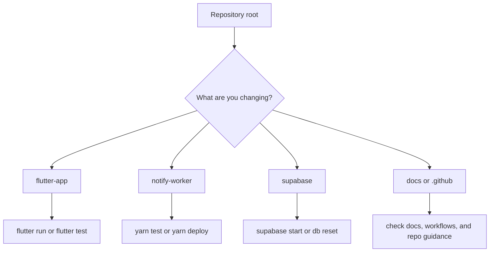

# Local Development

## Purpose

This guide is for running and validating the repository locally from the workspace root.
It keeps the day-to-day developer workflow out of the main `README.md` while still making the repo easy to boot up.

## Working from the repository root

This VS Code workspace stays rooted at the repository top level.
The checked-in launch and task configs point into the nested projects for you.

The same assumption applies to local AI-assisted development:

- start `copilot` from the repository root
- keep the repository root as the active VS Code workspace
- reference files in Copilot CLI and VS Code chat with repo-relative paths such as `docs\AI_ASSISTED_DEVELOPMENT.md` or `flutter-app\lib\main.dart`
- treat `.github\agents\`, `.github\skills\`, and `.github\prompts\` as part of the same root-scoped workflow surface

For folder-specific setup and caveats, the main top-level project directories have their own README files:

- [`..\flutter-app\README.md`](../flutter-app/README.md)
- [`..\notify-worker\README.md`](../notify-worker/README.md)
- [`..\supabase\README.md`](../supabase/README.md)

For repository automation guidance, use [`GITHUB_AUTOMATION.md`](GITHUB_AUTOMATION.md).

## Local prerequisites

- Flutter SDK for the web app workflow
- Node.js with Yarn or Corepack for `notify-worker\` and `supabase\`
- Supabase CLI for local backend commands
- A `flutter-app\env.json` file for local Flutter web runs

## Flutter app

- VS Code: use the `Flutter` launch config
- CLI:
  - `Push-Location .\flutter-app; flutter pub get; Pop-Location`
  - `Push-Location .\flutter-app; flutter run --dart-define-from-file env.json -d chrome --web-port 3000; Pop-Location`
  - `Push-Location .\flutter-app; flutter test; Pop-Location`
  - `Push-Location .\flutter-app; flutter test test\task_workspace_responsive_test.dart; Pop-Location`

### Responsive UI verification

Current responsive widget coverage lives in `flutter-app\test\task_workspace_responsive_test.dart`.

Use that targeted command when working on:

- shell breakpoints
- workspace split vs compact behavior
- dense-height behavior
- attached details and batch-panel behavior

See `LAB_SHELL_RESPONSIVE_SPEC.md` for the shell-wide responsive contract and the required resize-in-place automation strategy.

### Repository testing strategy

See `TESTING_STRATEGY.md` for:

- the current suite inventory
- the intended test taxonomy for this reliability lab
- the planned refactor direction for Flutter and worker suites
- the direction for a dedicated CI verification workflow

## Notify worker

- `Push-Location .\notify-worker; yarn install --frozen-lockfile; Pop-Location`
- `Push-Location .\notify-worker; yarn test; Pop-Location`
- `Push-Location .\notify-worker; yarn deploy; Pop-Location`

## Supabase

- `Push-Location .\supabase; yarn install --frozen-lockfile; Pop-Location`
- `Push-Location .\supabase; npx supabase start; Pop-Location`
- `Push-Location .\supabase; npx supabase db reset; Pop-Location`

## Related docs

- [`AI_ASSISTED_DEVELOPMENT.md`](AI_ASSISTED_DEVELOPMENT.md) for the intended human-and-agent engineering loop
- [`DEPLOYMENT.md`](DEPLOYMENT.md) for the deployed environment model and CI/CD contract
- [`ARCHITECTURE.md`](ARCHITECTURE.md) for system ownership and runtime topology
- [`TESTING_STRATEGY.md`](TESTING_STRATEGY.md) for the repository-wide testing contract
