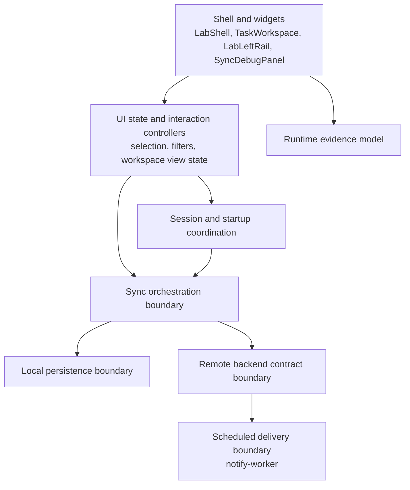

# Objective 0 Foundation Plan

## Purpose

This document translates **Objective 0** from `ROADMAP.md` into a concrete planning document for the next implementation and refactoring phase.

The goal is not another shell redesign.
The goal is to make the current reliability-lab shell rest on cleaner system boundaries before the repository commits to durable outbox, conflict, observability, and fault-injection work.

## Implemented baseline

Today the repository already has the right **product shape**, but not yet the right **structural shape** for the next reliability phases.

### Flutter app

Implemented now:

- `LabShell` is the active root UI
- `TaskWorkspace` is the canonical center pane
- `LabLeftRail` owns durable operator controls
- `SyncDebugPanel` renders runtime evidence from `RuntimeDebugProvider`
- `AgendaProvider` now primarily owns queue state, selection, filtering, and workspace-facing intents while coordination seams handle sync entry, startup/auth flow, local snapshot orchestration, and low-level task mutation rules
- `TaskSyncService` still performs task-level reconciliation rather than operation-level replay
- `TasksRepository` still represents a simple local snapshot store backed by SharedPreferences

### Backend surface

Implemented now:

- Supabase Auth remains the cloud identity source of truth
- task and subscription state live in Supabase tables and RPC-backed paths
- Edge Functions support browser push subscription save and removal flows
- the sync path is still documented as transitional and task-shaped rather than a stable long-term mutation contract

### Scheduled delivery

Implemented now:

- `notify-worker\src\index.ts` is an independently deployable Cloudflare Worker
- the worker polls due notifications, sends web push payloads, marks successful sends, and cleans up stale subscriptions
- the worker is already a separate operational surface and should stay that way

### Repository automation and docs

Implemented now:

- `verify.yaml` is the repository trust workflow
- frontend and worker deploys are separate workflows
- architecture, deployment, testing, and experiment docs already describe the current lab shell honestly

## Why Objective 0 comes before outbox work

The shell transformation solved the UI ownership problem.
It did **not** solve the deeper structural problem that several responsibilities are still too entangled:

- UI-facing providers still carry orchestration and persistence concerns
- the current task model still leaks sync-era assumptions that will not scale cleanly into an outbox model
- local persistence is still a coarse snapshot mechanism rather than a foundation for richer local inspection
- sync, runtime evidence, backend boundaries, and notification behavior are documented more clearly than they are structurally separated in code

If the repo adds durable outbox semantics directly on top of those seams, it risks freezing prototype debt into the next architecture.

## Desired end state after Objective 0

Objective 0 should leave the repository with a cleaner **target architecture**, even if the sync semantics are still transitional at the end of the refactor.

### Target architecture principles

1. **Keep shell ownership stable.** `LabShell`, `TaskWorkspace`, `LabLeftRail`, and `SyncDebugPanel` remain the durable UI model.
2. **Let providers own UI state, not every side effect.** UI-focused providers should stop being the place where selection, persistence, sync coordination, auth reactions, and diagnostics publication all mix together.
3. **Make sync a boundary, not a leak.** Even before a real outbox lands, the repository should treat sync as an explicit application boundary that can later swap from task reconciliation to operation replay.
4. **Separate local state concerns from cloud-contract concerns.** Shared local task snapshots, future local operation logs, remote sync contracts, and runtime evidence should be independently understandable.
5. **Preserve deploy-surface independence.** The notify worker remains a separate scheduled delivery surface, not a side effect of frontend deployment.

### Target responsibility map

This is intentionally a **boundary map**, not a promise of exact class names.
The important change is that the repo should move from a few large convenience-heavy components toward clearer application seams.

### Current Objective 0 progress after the bounded coordinator slice

This repository now has an initial code seam for four of the most immediate Objective 0 concerns:

- `TaskSyncCoordinator` sits between `AgendaProvider` and `TaskSyncService` so sync gating, post-sync reload, and runtime-debug skip behavior are no longer mixed directly into the provider
- `WorkspaceSessionCoordinator` sits between `TaskWorkspace`, `UserSessionService`, and authenticated startup behavior so workspace bootstrap and auth-session reactions are no longer mostly widget-owned
- `TaskLocalSnapshotCoordinator` now sits around `TasksRepository` so local snapshot load/save/remove/clear behavior is no longer mixed directly into `AgendaProvider`
- `TaskMutationCoordinator` now owns task-list mutation rules so `AgendaProvider` is less responsible for low-level completion, delete, and anonymous-adoption mutation details

This slice is intentionally bounded.
It does **not** add outbox semantics, change the remote task-reconciliation contract, or replace SharedPreferences.

## Structural issues to refactor in Objective 0

### 1. `AgendaProvider` is carrying too much architectural weight

Current issue:

- task collection and filtering
- selection and queue state
- persistence triggers
- sync triggering
- auth-adjacent startup behavior
- diagnostics count publication

Objective 0 should reduce that coupling so later outbox work does not have to unwind a monolithic provider first.

### 2. The sync boundary is still represented mostly by one service plus task metadata

Current issue:

- `TaskSyncService` is a real implementation seam, but not yet a durable architectural contract
- task-shaped reconciliation assumptions still leak into the broader app model
- runtime diagnostics can report sync outcomes, but not a richer sync lifecycle contract

Objective 0 should leave the repo with a clearer seam between:

- local task state
- sync coordination
- remote reads and writes
- runtime evidence publication

### 3. Local persistence is too coarse for the next phases

Current issue:

- `TasksRepository` stores a whole local snapshot under SharedPreferences
- the current model is workable for the prototype but not expressive enough for future outbox durability or richer local inspection

Objective 0 does **not** need to replace SharedPreferences yet.
It **does** need to stop assuming that the current snapshot model is the long-term architectural shape.

### 4. Backend boundaries are still more implied than explicit

Current issue:

- the repo uses Supabase successfully, but the long-term sync boundary is still undecided
- current docs already call out open decisions around RPC vs Edge Function vs another backend surface
- later auditability and idempotency work will be easier if the frontend is refactored toward an explicit backend contract now

### 5. The worker is independent operationally, but not yet documented as part of a cleaner end-to-end contract

Current issue:

- the worker behavior is implemented and valuable
- the longer-term architecture still needs a clearer contract between app-side notification state, backend notification selection, and delivery-attempt observability

Objective 0 should improve the **system boundary documentation** around the worker without coupling it to frontend-only refactors.

## Concrete implementation and refactoring phases

### Phase 1 - Freeze the target boundary map

Goal:

- agree on what the repo is preserving, replacing, or deferring before code churn begins

Primary surfaces:

- `docs\ARCHITECTURE.md`
- `docs\project_analysis.md`
- `ROADMAP.md`
- this document

Deliverables:

1. a keep/replace/defer matrix for the current Flutter app layers
2. an explicit target boundary map for UI state, session coordination, sync orchestration, local persistence, backend contract, runtime evidence, and scheduled delivery
3. a list of design flaws that Objective 0 will address immediately versus leave for Objective 1+

Recommended output of this phase:

- `LabShell`, `TaskWorkspace`, `LabLeftRail`, and `SyncDebugPanel` are preserved
- `AgendaProvider`, `TaskSyncService`, and `TasksRepository` are evaluated as refactor targets rather than permanent shapes
- the long-term sync boundary stays open, but the frontend is no longer allowed to depend on that decision remaining fuzzy

### Phase 2 - Refactor the Flutter app around clearer boundaries

Goal:

- keep the current UI behavior while cleaning up the ownership model under `flutter-app\lib\`

Primary surfaces:

- `flutter-app\lib\providers\`
- `flutter-app\lib\services\`
- `flutter-app\lib\repositories\`
- `flutter-app\lib\models\`
- `flutter-app\lib\widgets\lab\`
- `flutter-app\lib\widgets\debug\`

Recommended work:

1. slim `AgendaProvider` toward workspace-facing state and user intents
2. move startup/session-side effects behind clearer session coordination responsibilities
3. isolate sync orchestration from widget-facing queue state
4. isolate local persistence responsibilities from higher-level workflow orchestration
5. keep `RuntimeDebugProvider` as the UI-facing evidence model, but reduce ad hoc update coupling from unrelated layers

Expected outcome:

- the app keeps the same visible shell
- the code becomes easier to evolve toward outbox semantics without another large UI refactor
- future conflict and outbox state can be attached to a cleaner application layer

### Phase 3 - Clarify the backend contract without implementing the full outbox yet

Goal:

- make the backend boundary explicit enough that the future outbox does not need another architecture reset

Primary surfaces:

- `supabase\migrations\`
- `supabase\functions\`
- `flutter-app\lib\services\`
- `flutter-app\lib\repositories\`

Recommended work:

1. decide what the app should treat as the current sync gateway abstraction
2. document which current reads and writes are transitional and which should be preserved
3. identify what audit-oriented tables or server-owned timestamps will be required later, without claiming they already exist
4. remove or reduce direct task-shaped assumptions that would make operation-based replay harder

Important constraint:

Objective 0 should prepare the contract surface.
Objective 0 should **not** pretend that idempotency, conflict handling, and durable mutation replay are already solved.

### Phase 4 - Tighten the scheduled delivery boundary

Goal:

- keep `notify-worker\` operationally separate while making its place in the system model cleaner

Primary surfaces:

- `notify-worker\src\index.ts`
- `notify-worker\README.md`
- `supabase\migrations\`
- `docs\ARCHITECTURE.md`
- `docs\DEPLOYMENT.md`

Recommended work:

1. keep the worker deploy path independent from the Flutter app
2. document the worker as a delivery boundary, not as a hidden extension of the frontend
3. identify what delivery-attempt history or audit seams the later architecture will need
4. make sure any backend refactor does not quietly break the worker's pending-notification contract

### Phase 5 - Prepare Objective 1 instead of starting it implicitly

Goal:

- leave the repo ready for explicit outbox semantics without partially implementing them by accident

Objective 0 is complete when:

- the app's visible shell still matches the current lab model
- the current architecture is less entangled than it is today
- the next outbox phase can land on intentional seams instead of prototype-era shortcuts

Objective 0 is **not** complete just because files moved around.
The refactor has to make the future system easier to reason about.

## Recommended scope boundaries

Implement in Objective 0:

- responsibility cleanup
- clearer boundary definitions
- provider/service/repository refactors
- documented current-vs-target architecture
- worker and backend contract cleanup that preserves current behavior

Do not treat as part of Objective 0 unless explicitly expanded later:

- full durable outbox implementation
- conflict resolution workflow
- fault injection features
- stronger local database replacement
- CI/CD orchestration redesign beyond documenting the current trust model
- new product-surface expansion unrelated to reliability semantics

## Affected docs and follow-through

The Objective 0 implementation phase should keep these docs aligned:

- `docs\ARCHITECTURE.md`
- `docs\project_analysis.md`
- `docs\TESTING_STRATEGY.md` when verification scope changes
- `docs\DEPLOYMENT.md` if workflow or runtime contracts change
- `docs\README.md`
- `README.md`
- `notify-worker\README.md` when delivery behavior or worker boundaries change
- `supabase\README.md` when backend contract expectations change materially

## Verification required by this plan

Use the existing repo commands only:

- Flutter app verification: `Push-Location .\flutter-app; flutter test; Pop-Location`
- worker verification: `Push-Location .\notify-worker; yarn test; Pop-Location`

Validation expectations by phase:

1. provider, service, repository, widget, or sync refactors in `flutter-app\` must keep Flutter tests green
2. worker or worker-facing backend changes must keep worker tests green
3. docs and workflow changes must stay aligned with the actual repo files and commands

## Open decisions that Objective 0 should surface explicitly

These decisions do not all need to be implemented during Objective 0, but the refactor should make them easier to answer instead of harder:

1. what the long-term sync boundary should be: Supabase RPC, Edge Function, or another backend surface
2. when SharedPreferences should give way to stronger local persistence for a durable outbox
3. how conflict policy should eventually work: reject, merge, or explicit user resolution
4. what notification guarantee the lab wants to model over time: best-effort, at-least-once, or at-most-once

## Practical reading of the plan

The repository does **not** need another broad visual redesign.
It needs a foundation pass that makes the current shell honest, evolvable, and ready for deeper reliability semantics.

That is the purpose of Objective 0.

---

# Task After Completing Objective 0

Remove this document file from the git repo and all mentions of it from other docs. Then check if there are any stale references to Objective 0 in the repo's docs, workflows, or guidance and update them accordingly.
