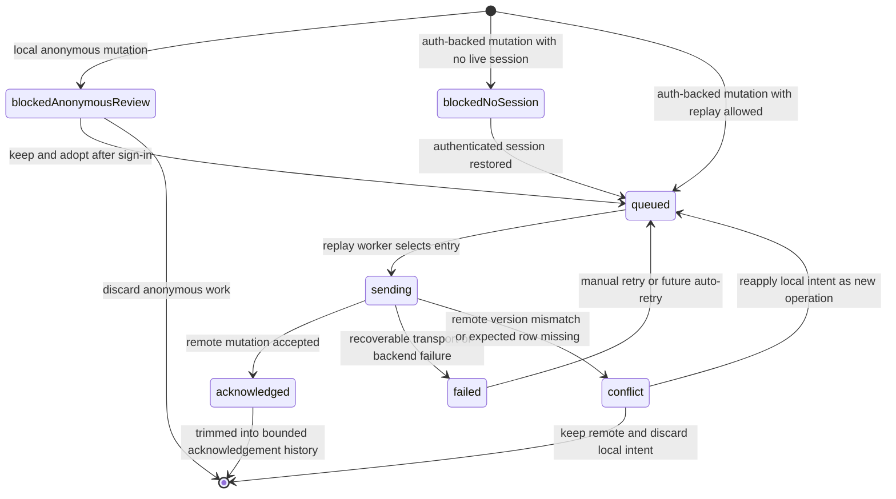
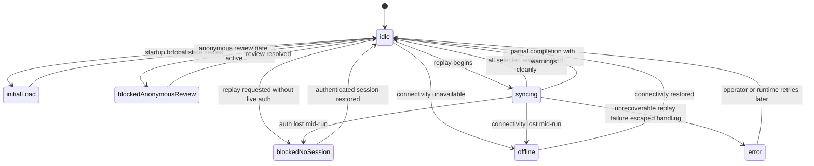

# Objective 1 Outbox Execution Plan

## Purpose

This document turns the Objective 1 entry plan into an execution-ready plan for the first explicit outbox slice.

It is still a planning document.
Nothing in this file should be read as implemented behavior unless the implementation docs are updated alongside the code.

## Scope of this plan

This plan defines the **first real outbox slice** for the Flutter client.

It is intentionally optimized for the current repository state:

- keep the lab shell visually stable
- land on the completed Objective 0 seams instead of bypassing them
- improve sync honesty and operator visibility before introducing a larger backend redesign
- preserve the independently deployable worker surface

## Planning decisions now fixed for the first slice

These decisions were made explicitly for this plan and should be treated as the implementation contract unless they are changed in the docs before coding starts.

### Backend mutation boundary

Keep direct `tasks` table CRUD temporarily for the first outbox slice.

Why:

- it minimizes backend churn while the client-side outbox semantics are still being proven
- it keeps Objective 1 focused on explicit local operation state, replay rules, and operator visibility
- it does not prevent a later move to RPC or Edge Functions once the replay contract is stable

### Local durability

Keep SharedPreferences for the first slice.

Why:

- the repository already treats SharedPreferences as a local snapshot boundary
- Objective 1 is primarily about explicit sync semantics, not final persistence strength
- the stronger local storage migration remains part of the later realism phase rather than a prerequisite for the first outbox slice

Constraint:

SharedPreferences remains a transitional durability layer.
The implementation must describe that honestly in the docs and should avoid pretending this is already a production-grade durable operation log.

### Operation granularity

Use a generic task-oriented operation model first:

- `upsert`
- `delete`

Why:

- it gives the lab explicit operation state quickly
- it reduces the first-slice surface area for mutation compaction, replay, and diagnostics
- it leaves room for a later split into finer verbs such as complete, reopen, or reschedule if the lab needs more granular scenarios

### Compaction policy

Compact local edits to the latest effective operation per task before replay.

Meaning:

- multiple local edits before sync collapse into one latest `upsert`
- `upsert` followed by `delete` collapses to `delete` when the task is still expected to exist remotely
- local add followed by local delete before any remote acknowledgement collapses away entirely

Why:

- it matches the current repo goal of making sync explicit without introducing a full audit log yet
- it simplifies replay and conflict handling
- it still gives the lab enough visibility to model queued, failed, blocked, and conflicted work honestly

### Replay ordering

Replay FIFO by the earliest surviving operation timestamp after compaction.

Why:

- it is the easiest ordering rule to explain and test
- it preserves causal ordering better than newest-first replay
- it keeps future delay and interruption experiments understandable in the diagnostics rail

### Conflict policy

Conflicts are explicit, user-visible, and block replay for the affected operation.

First-slice conflict actions:

- keep remote and discard local intent
- reapply local intent as a new queued operation

Not in scope for the first slice:

- field-by-field manual merge UI
- silent last-write-wins without evidence

### UI ownership

`Runtime Diagnostics` is the primary home for outbox evidence.
`TaskWorkspace` is the secondary home for task-scoped notices and task-level entry points.

Why:

- the shell already reserves diagnostics space for explicit operation states
- this avoids another structural UI redesign before the outbox lands
- task-level conflict or failure indicators can still remain discoverable from the workspace and inspector

### Anonymous-task handling

Anonymous local work should become blocked outbox entries immediately.

Meaning:

- pre-login local tasks are represented as explicit blocked operations, not only as loose task state
- authenticated replay still pauses at the current keep-or-discard review gate
- choosing keep rebinds the entries to the authenticated user and queues them for replay
- choosing discard removes both the blocked entries and the corresponding local tasks

### Sign-out behavior

Continue clearing the local task projection and local outbox state on explicit sign-out so user-bound work does not remain visible to the next session on the same device.

Why:

- the workspace must return to a clean user boundary when someone signs out on a shared browser profile
- remote-backed tasks should stay scoped to the account that created or adopted them
- missing-session replay can still be modeled during interrupted sync paths without keeping the signed-out workspace visible

### Acknowledgement retention

Keep a short recent acknowledgement history for diagnostics instead of removing successful operations immediately.

Why:

- the lab gains visible evidence that replay actually happened
- the retained history helps delayed-sync and partial-sync demonstrations
- storage remains bounded because this is only a short rolling history

Current implemented limit:

- the first slice keeps up to 10 recent acknowledgements in local outbox storage
- there is no time-based expiry yet
- Runtime Diagnostics now exposes a manual clear action for recording, demos, or other cases where the operator wants a clean acknowledgement history without wiping tasks or active outbox entries
- Runtime Diagnostics now exposes a soft demo reset action that clears retained acknowledgements plus transient diagnostics surfaces such as sync outcome history, fault-injection UI state, and timeline events while preserving auth state, push state truth, local tasks, and active outbox entries
- Runtime Diagnostics also exposes a hard reset action that first replays delete operations for authenticated remote-backed tasks, then wipes all local task and outbox state after the remote deletions are confirmed

## First-slice target behavior

After Objective 1 lands, the intended behavior for the first slice is:

1. local task mutations update the visible task projection immediately
2. the same local mutation also updates an explicit outbox entry set
3. the outbox, not `TaskModel.syncStatus`, becomes the authoritative source of pending cloud work
4. sync replay operates on outbox entries rather than task-diff heuristics
5. blocked, queued, sending, failed, conflict, and acknowledged states become visible in the shell
6. anonymous work remains review-gated before authenticated replay
7. explicit sign-out still clears the local task projection and local outbox state so the next session starts from a clean workspace boundary

## Current implementation status

Implemented so far from this execution plan:

- Phase A groundwork is now in place in the Flutter app
- the repository now has an explicit `OutboxEntry` model and local outbox persistence beside the existing task snapshot
- startup now initializes a migration-aware local-state coordinator that derives first-slice outbox entries from the legacy dirty-task snapshot model
- local task persistence now preserves explicit outbox state and resets only the entries affected by the latest mutation set
- `TaskModel` now carries lightweight remote-backing metadata used by compaction and replay safety rules
- direct mutation flows now pass changed task ids through to coordinated local persistence so add, update, complete, delete, and anonymous-adoption resets stay task-scoped
- the coordinated sync path now replays explicit outbox entries in FIFO order, advances them through `queued`, `sending`, `acknowledged`, `failed`, `conflict`, and `blockedNoSession`, and retains a short acknowledgement history
- the runtime diagnostics rail now shows real outbox counts and recent acknowledgements instead of placeholder operation-state chips
- the workspace header now exposes lightweight failed, conflict, and blocked-review notices
- the diagnostics rail now exposes first-slice conflict resolution actions for keeping remote state or re-queuing the local intent with the latest remote base
- sign-out now clears the local task projection and local outbox state again so authenticated work does not remain visible across user sessions on the same device

Not implemented yet from this execution plan:

- a stronger durability layer than SharedPreferences

Important current constraint:

The coordinated local-state path now uses the explicit outbox as the active replay authority.
The older task-based sync path still exists as a fallback for seams that are not yet wired through the coordinated outbox state layer.

## Explicit non-goals for the first slice

These items remain intentionally out of scope for this execution plan:

- introducing a Supabase RPC or Edge Function mutation gateway immediately
- introducing a stronger local database immediately
- adding server-side idempotency storage in this slice
- adding a field-by-field merge UI
- redesigning the shell layout again
- changing notification delivery architecture
- expanding the worker unless the implementation later proves it necessary

## Data model plan

### 1. Keep `TaskModel` as the user-facing local projection

The task list remains the immediate projection rendered in the workspace.
The outbox becomes the source of truth for pending replay.

For the first implementation slice, the repository should keep current task serialization fields needed for compatibility and migration, but the implementation should stop treating task-shaped dirty or deleted flags as the replay authority.

### 2. Add an explicit outbox entry model

Planned model shape:

- `id`: stable local operation id
- `taskId`: task identity the operation applies to
- `operationType`: `upsert` or `delete`
- `state`: queued, sending, acknowledged, failed, conflict, blockedNoSession, blockedAnonymousReview
- `ownerScope`: anonymous or authenticated
- `createdAt`: operation creation timestamp
- `updatedAt`: last local state transition timestamp
- `firstQueuedAt`: first timestamp the entry became replay-eligible
- `lastAttemptAt`: last replay attempt timestamp
- `attemptCount`: replay attempts made
- `lastError`: latest recoverable or permanent failure description
- `baseRemoteUpdatedAt`: last known remote version when the operation was created
- `taskPayload`: local payload snapshot for replay
- `remoteSnapshot`: optional remote state captured when a conflict is detected

### 3. Add lightweight task sync metadata required for compaction safety

The task projection should retain enough metadata to distinguish:

- local-only tasks that have never been acknowledged remotely
- tasks that already have a remote backing row

This is necessary so add-then-delete can compact away safely while delete of an already-remote task remains a real replayable operation.

## Local persistence plan

### 1. Keep task snapshot storage

The current task snapshot remains persisted locally.

### 2. Add dedicated outbox storage beside it

The outbox must not be hidden inside the task snapshot payload.
It should have its own repository and persistence key so the implementation can evolve later without entangling task projection and replay state.

### 3. Add a local-state coordinator above snapshot and outbox storage

The first slice should introduce a coordinator responsible for:

- loading the task snapshot and outbox together
- saving coordinated projection-plus-outbox changes
- running one-time migration from legacy dirty-task semantics
- applying startup consistency repair when snapshot and outbox state drift

### 4. Accept transitional atomicity limits honestly

Because SharedPreferences does not give transactional guarantees, the implementation should document the write ordering and startup repair behavior explicitly.

Recommended write discipline:

- on enqueue or local mutation: write task projection first, then outbox
- on successful acknowledgement: update task projection first, then move the operation into short acknowledgement history
- on startup: run a small repair pass that reconciles known partial-write cases

## Migration plan

The first startup after Objective 1 should migrate legacy local sync markers into explicit outbox entries.

Migration rules:

- authenticated dirty task -> one queued `upsert`
- authenticated deleted tombstone -> one queued `delete`
- anonymous visible task -> one blocked-anonymous-review `upsert`
- deleted anonymous tombstone -> remain pruned as they are today

Migration guardrails:

- if outbox storage already exists, do not re-run migration
- keep migration idempotent
- log a runtime event when migration occurs
- preserve visible local tasks unless the old behavior already pruned them intentionally

## Mutation flow plan

The existing widget-facing surface should stay stable.
The new behavior should land behind the current Objective 0 seams.

### Planned mutation rule changes

Every task mutation should now produce two things:

- the next visible task projection
- the next outbox patch

Planned compaction rules for the first slice:

1. create -> queue one `upsert`
2. edit existing task -> replace or update the queued `upsert` for that task
3. complete or reopen -> collapse into the latest `upsert`
4. reschedule -> collapse into the latest `upsert`
5. delete remote-backed task -> replace any queued `upsert` with one `delete`
6. create then delete before remote acknowledgement -> remove the local task and remove the operation entirely
7. anonymous mutations -> create blocked anonymous-review entries immediately

## Sync replay plan

### Replay authority

The outbox becomes the only authoritative list of pending cloud work.

### Planned finite state machine

There is a planned state machine for Objective 1.
It is not fully implemented yet.

What exists now:

- the runtime has sync-phase state in the diagnostics model
- the app now persists explicit outbox entries as Phase A groundwork
- replay still runs through the legacy task-based engine

What Objective 1 is adding:

- an explicit **operation-state machine** for each outbox entry
- a coordinating **sync-run state machine** for the whole replay pass

Those two machines are related, but they are not the same thing.

### Planned outbox entry state machine

### Outbox entry state meanings and expected behavior

| State                    | Meaning                                                                                                                                          | Expected app behavior                                                                                                                                                          |
| ------------------------ | ------------------------------------------------------------------------------------------------------------------------------------------------ | ------------------------------------------------------------------------------------------------------------------------------------------------------------------------------ |
| `blockedAnonymousReview` | The local mutation came from anonymous work and cannot be replayed into an authenticated cloud scope until the operator chooses keep or discard. | Keep the task visible locally, show review-required evidence, do not send it to the backend, and route the operator through the existing keep-or-discard decision flow.        |
| `blockedNoSession`       | The mutation belongs to authenticated cloud state, but there is no live authenticated session right now.                                         | Preserve the entry for interrupted replay paths that lost session state without an explicit sign-out, show that replay is blocked on auth, and do not attempt remote mutation. |
| `queued`                 | The operation is eligible for replay and waiting its turn.                                                                                       | Keep local state visible, include the entry in queued counts and diagnostics, and allow replay selection in FIFO order.                                                        |
| `sending`                | The replay engine is currently processing the entry against the backend.                                                                         | Persist the transition before attempting the network call, surface in-progress evidence, and avoid selecting the same entry again concurrently.                                |
| `acknowledged`           | The backend accepted the operation and local projection has been updated to the acknowledged result.                                             | Remove the entry from active replay, keep only short recent acknowledgement evidence, and update local task metadata so the task is no longer pending.                         |
| `failed`                 | The replay attempt ended with a recoverable error and the entry still needs another attempt.                                                     | Preserve the entry, record attempt count and last error, surface retry-needed evidence, and allow later retry without losing local intent.                                     |
| `conflict`               | The backend state diverged enough that replay cannot continue honestly without operator choice.                                                  | Preserve both the local intended payload and enough remote evidence to explain the divergence, stop replay for that entry, and expose explicit resolution actions.             |

### Planned sync-run state machine

The outbox entry machine above explains the state of one operation.
The runtime diagnostics surface still needs a higher-level machine for the whole replay pass.

### Sync-run state meanings and expected behavior

| Runtime sync phase       | Meaning                                                                       | Expected app behavior                                                                                                                           |
| ------------------------ | ----------------------------------------------------------------------------- | ----------------------------------------------------------------------------------------------------------------------------------------------- |
| `initialLoad`            | The app is restoring local snapshot, outbox state, and session context.       | Keep the shell bootstrapping state visible and do not start replay until local state and session truth are known.                               |
| `idle`                   | No replay pass is currently running.                                          | Show the latest known evidence and allow replay to start if the gates are open.                                                                 |
| `offline`                | Replay cannot start or continue because the network boundary is unavailable.  | Preserve local intent, do not mutate the backend, and surface clear evidence that the stop reason is connectivity rather than auth or conflict. |
| `blockedNoSession`       | Replay cannot start because a live authenticated session is required.         | Preserve local intent and show auth recovery as the gating condition.                                                                           |
| `blockedAnonymousReview` | Replay cannot start because anonymous local work still needs operator review. | Preserve local intent and route the operator to keep or discard rather than attempting replay.                                                  |
| `syncing`                | The runtime is actively selecting and processing replayable outbox entries.   | Transition entries one at a time into `sending`, update diagnostics, and stop cleanly if auth or connectivity closes.                           |
| `error`                  | An unexpected error escaped the planned replay handling path.                 | Preserve local intent, surface an explicit error outcome, and avoid destructive cleanup or silent state loss.                                   |

### How the outbox works in practice

The planned runtime behavior is:

1. a local mutation updates the visible task projection immediately
2. the same mutation creates or compacts one explicit outbox entry for that task
3. the task list remains the user-facing projection, but the outbox becomes the replay source of truth
4. the sync engine scans replayable entries in FIFO order
5. each selected entry moves through `queued -> sending -> acknowledged|failed|conflict`
6. blocked entries stay visible but are never sent until their gate opens
7. successful entries leave the active queue and remain only in bounded acknowledgement history
8. failed entries stay retryable
9. conflicted entries stay blocked until the operator either keeps remote or reapplies local intent

That is the planned finite state machine contract Objective 1 is implementing.
You were not wrong to call it a state machine.
The important correction is that the repo currently has only the sync-phase half implemented in the diagnostics model, while the operation-state half is only partially present through the new outbox persistence groundwork.

### Replay algorithm for the first slice

For each replay run:

1. refresh connectivity evidence
2. confirm an authenticated session exists
3. stop immediately if the session boundary or connectivity boundary is closed
4. select replayable entries in FIFO order
5. skip blocked anonymous-review and blocked no-session entries
6. mark the next active entry as sending and persist that transition
7. execute remote mutation using the current direct CRUD path
8. on success, update the task projection and move the entry into short acknowledgement history
9. on recoverable error, mark failed and continue so the run can be partial
10. on conflict, mark conflict and stop replay for that entry until operator action resolves it

### Conflict detection for the first slice

Detect conflicts using explicit remote-version comparison rather than only local timestamps.

Conflict conditions:

- the remote row exists but `updated_at` no longer matches `baseRemoteUpdatedAt`
- an update expects a remote row but the row is missing
- a delete expects a remote row but the row is missing

Chosen first-slice behavior for missing remote rows:

- treat them as conflicts requiring operator resolution

### Conflict resolution plan

Operator actions for the first slice:

1. keep remote and discard local intent
2. reapply local intent as a fresh queued operation using the latest remote version as the new base

## UI plan

### Runtime Diagnostics

This remains the primary home for outbox evidence.

The current placeholder operation-state section should become a real section showing:

- queued count
- sending count
- failed count
- conflict count
- blocked anonymous-review count
- blocked no-session count
- recent acknowledgement history
- recent operation events with task-level detail where available

### Task Workspace

The workspace should remain secondary UI ownership.

Planned first-slice additions:

- task-level badges or notices for failed or conflicted work
- inspector-level actions that deep-link the operator into diagnostics or conflict handling
- no full shell redesign

### Operator Rail

The operator rail should keep its current role.
It does not need to become the primary outbox UI in this slice.

## Auth and session plan

### Startup

Startup should load the local task projection and outbox together, run migration if needed, and surface any anonymous review gate before authenticated replay begins.

### Sign-in

If anonymous entries exist:

- pause authenticated replay
- show the current keep-or-discard review gate
- on keep, adopt the entries into the authenticated scope and queue them
- on discard, remove the entries and their local tasks

If no anonymous review is pending:

- start replay for authenticated eligible entries
- keep current push registration sequencing

### Sign-out

On sign-out:

- clear the local task projection
- clear the local outbox state on this device
- clear authenticated session truth in diagnostics
- let the next session rebuild from its own local or remote truth instead of inheriting the previous user's workspace

## Implementation sequence

This is the recommended execution order.

### Phase A - Contract and model setup

1. Add the outbox model and serialization.
2. Add outbox repository and SharedPreferences persistence.
3. Add a local-state coordinator that can load snapshot and outbox together.
4. Add migration logic from legacy dirty-task state.

### Phase B - Mutation pipeline

1. Refactor mutation results so they can carry both projection and outbox changes.
2. Update mutation compaction rules.
3. Preserve current widget-facing provider methods.

### Phase C - Replay engine

1. Change sync replay from task-based heuristics to outbox-based replay.
2. Add sending, failed, acknowledged, blocked, and conflict state transitions.
3. Add conflict detection and the first two conflict resolution actions.

### Phase D - Runtime evidence and UI

1. Replace diagnostics placeholders with real outbox counts and events.
2. Add workspace-level failed and conflict indicators.
3. Preserve shell shape and current operator-rail role.

### Phase E - Auth and recovery

1. Update startup flow for migration and outbox load.
2. Update sign-in anonymous review behavior to operate on outbox entries.
3. Keep explicit sign-out aligned with the pre-outbox workspace boundary by clearing local task and outbox state on this device.

### Phase F - Verification and docs

1. Add the first outbox-focused tests.
2. Run the existing repo verification commands.
3. Update architecture, testing, experiments, and overview docs to match what was actually implemented.

## File-level execution map

The following surfaces are expected to change first.

### Flutter app

- `flutter-app/lib/models/task.dart`
- `flutter-app/lib/models/runtime_debug_state.dart`
- `flutter-app/lib/providers/runtime_debug_provider.dart`
- `flutter-app/lib/providers/agenda_provider.dart`
- `flutter-app/lib/repositories/tasks_repository.dart`
- `flutter-app/lib/services/task_local_snapshot_coordinator.dart`
- `flutter-app/lib/services/task_mutation_coordinator.dart`
- `flutter-app/lib/services/task_sync_flow_coordinator.dart`
- `flutter-app/lib/services/task_sync_coordinator.dart`
- `flutter-app/lib/services/task_sync_service.dart`
- `flutter-app/lib/services/workspace_session_coordinator.dart`
- `flutter-app/lib/widgets/debug/sync_debug_panel.dart`
- `flutter-app/lib/widgets/lab/task_workspace.dart`

### New likely Flutter files

- `flutter-app/lib/models/outbox_entry.dart`
- `flutter-app/lib/services/outbox_repository.dart`
- `flutter-app/lib/services/task_local_state_coordinator.dart`

### Flutter tests most likely to grow

- `flutter-app/test/task_sync_coordinator_test.dart`
- `flutter-app/test/task_sync_flow_coordinator_test.dart`
- `flutter-app/test/task_mutation_coordinator_test.dart`
- `flutter-app/test/sync_logic_test.dart`
- `flutter-app/test/sync_debug_panel_test.dart`
- plus new outbox-specific tests

## Verification plan

The repository should keep using the existing verification commands during Objective 1.

Required first-slice verification:

- Flutter app verification: `Push-Location .\flutter-app; flutter test; Pop-Location`
- worker verification only if worker-facing code or contracts change: `Push-Location .\notify-worker; yarn test; Pop-Location`

Minimum new tests expected from Objective 1:

- migration from legacy dirty-task state to outbox state
- mutation compaction rules
- blocked anonymous-review entry handling
- FIFO replay ordering
- partial replay behavior
- conflict creation when remote version changes
- conflict resolution for keep-remote and reapply-local
- signed-out workspace clearing at the session boundary
- diagnostics state counts and event rendering for outbox entries

## Documentation follow-through required once implementation starts

When the first implementation slice lands, update these docs in the same change:

- `docs/ARCHITECTURE.md`
- `docs/TESTING_STRATEGY.md`
- `docs/EXPERIMENTS.md`
- `docs/README.md`
- `README.md`
- `flutter-app/README.md`

Update them honestly.
Until the implementation exists, these docs should continue describing the outbox as planned work rather than implemented behavior.

## Commit slicing recommendation

Prepare Objective 1 as small coherent units rather than one long diff.

Recommended commit boundaries:

1. docs: record the Objective 1 execution contract
2. flutter-app: add outbox models, storage, and migration support
3. flutter-app: refactor mutation flow to projection-plus-outbox updates
4. flutter-app: refactor replay engine to operate on outbox entries
5. flutter-app: add diagnostics and workspace conflict or failure visibility
6. flutter-app: add outbox-focused tests
7. docs: align architecture and testing docs with the implemented slice

## Why this is the right first outbox slice

This plan chooses the smallest change that materially improves the lab:

- it makes pending work explicit
- it makes replay states visible
- it makes conflict handling honest
- it keeps the shell stable
- it avoids locking the repository into a premature backend redesign

The tradeoff is deliberate.
This first slice adds substantial value in operator visibility and sync honesty, but it does not yet solve long-term durability, server-owned idempotency, or full auditability.
Those remain later steps once the client-side operation model has proven itself.
