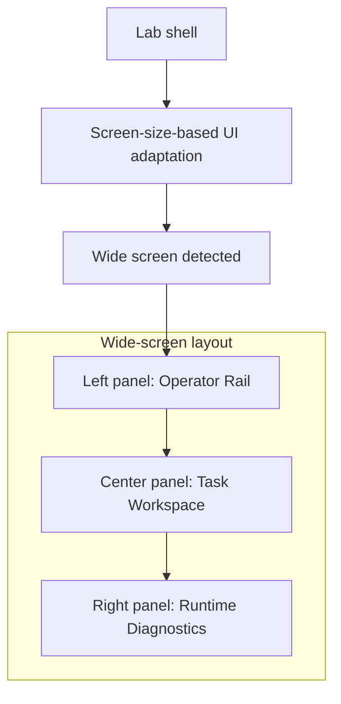
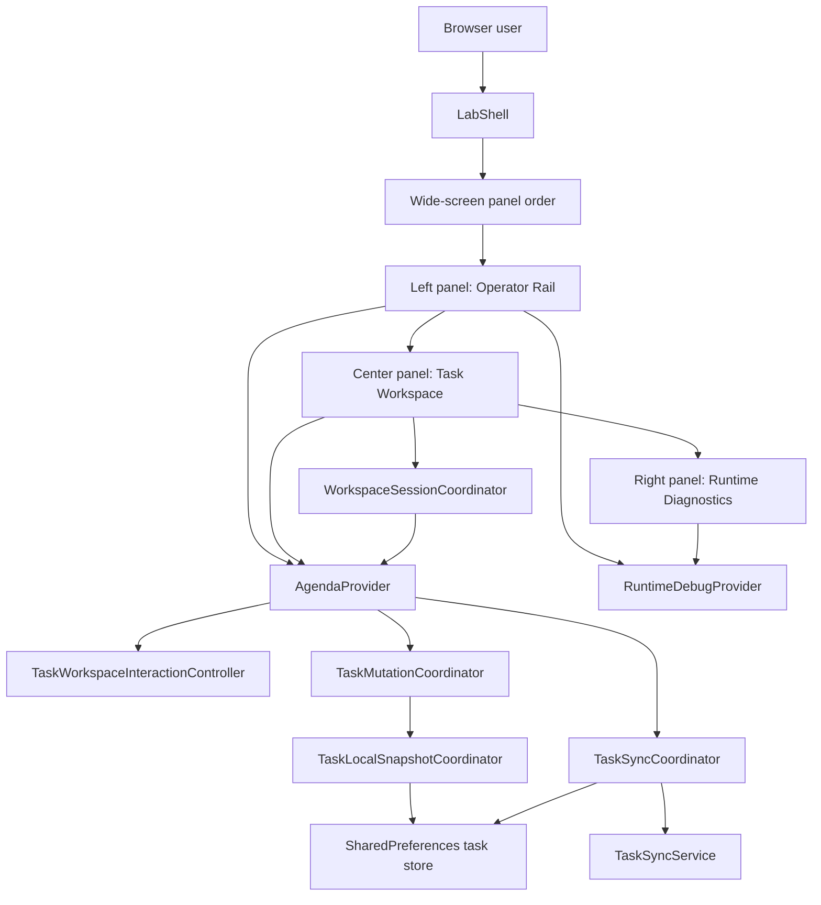
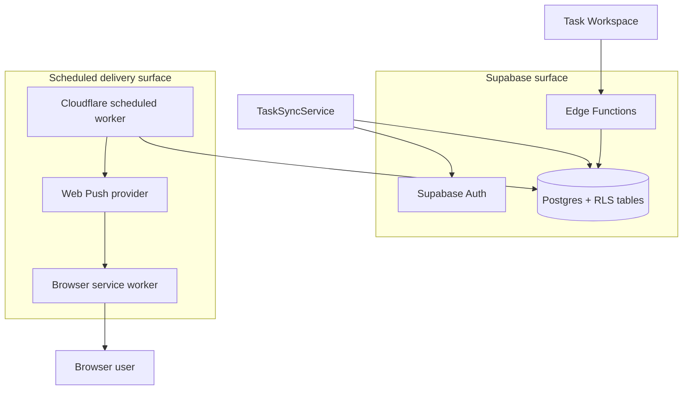

# SaaS Reliability Lab

A web-first reliability lab built around a small task domain so sync, auth, push, and offline behavior can be observed directly in the product UI.

This repository is in the middle of a deliberate structural transformation:

- from a centered task-list app
- to a reliability-lab workspace with a durable operator shell and live runtime diagnostics

The task domain is still useful, but it is no longer the point.
The point is to study what breaks, what recovers, and what remains visible when a small SaaS starts operating under imperfect conditions.

## What exists today

- Flutter Web PWA with a three-pane lab shell:
  - Operator Rail
  - Task Workspace
  - Runtime Diagnostics
- Local-first task CRUD with SharedPreferences persistence
- Supabase authentication and per-user task sync
- Runtime diagnostics state for connectivity, auth, sync, push, and local task counts
- Browser push registration for signed-in profiles
- Scheduled notification dispatch through a Cloudflare Worker
- Anonymous-to-authenticated task adoption or discard flow
- Deletion lifecycle fix: local-only anonymous deletes are purged immediately, while account-backed deletes stay tombstoned only until sync confirms the remote delete

## What this repository is trying to achieve

The current shell transformation is the foundation, not the finish line.

The next major goals are:

- replace task-level dirty-object sync with an explicit operation outbox
- surface conflict and blocked-sync states as first-class UI states
- add fault-injection controls to the operator shell
- strengthen observability beyond the in-app runtime panel
- grow automated coverage for reliability-critical paths

## Current UI shape

The app now opens into a lab-style workspace rather than a single centered task screen.
On wide layouts, the center pane is intentionally width-limited and organized as a desktop task canvas rather than a full-width stretched list.

### Operator Rail

- session and auth actions
- manual sync trigger
- persistent task filters
- anonymous-task review controls
- reserved space for future fault injection and experiment toggles

### Task Workspace

- bounded desktop-first canvas instead of a full-width stretched task list
- queue controls for search, scope, counts, and local session notices
- dedicated task queue for browsing and selecting tasks
- persistent task inspector for selected-task details and actions
- scrollable attached details and batch panels on narrower widths

### Runtime Diagnostics

- connectivity and sync lifecycle state
- explicit last success, skip, partial, and failure outcomes
- session truth versus cached identity
- local dirty, deleted, and anonymous counts
- push permission and subscription state
- recent runtime event timeline
- reserved placeholders for future queued, sending, acknowledged, failed, and conflict operation states

On narrow screens, the rails move into drawers so observability remains accessible without reintroducing the old centered layout as the primary model.

## Current system model

The current system model is easier to read as one browser-runtime view and one external-integration view.

Important current constraint:

The sync engine is still task-based, not operation-based.
The UI is intentionally reserving space for an explicit outbox and conflict model that does not exist yet in the backend contract.
That is also why a true archive or trash workflow is documented as the next safe evolution rather than implemented as a local-only patch today.

## Current status

### Implemented now

- the new lab shell is the active root UI
- `TaskWorkspace` is the canonical center pane and now uses a bounded master/detail layout
- `TaskList` remains only as a compatibility wrapper
- runtime state is modeled explicitly through `RuntimeDebugProvider` and `RuntimeDebugState`
- the client now routes workspace interaction state, session flow, sync entry, local snapshot handling, and task mutation rules through dedicated seams around `TaskWorkspace` and `AgendaProvider`
- sync, auth, connectivity, local counts, and push state are visible in the UI
- push notifications work end to end for signed-in browser profiles

### Still missing

- durable outbox semantics
- per-operation acknowledgement and retry state
- explicit conflict capture and resolution
- fault-injection controls
- stronger structured logging and metrics
- broad automated coverage across multi-device and failure scenarios

## Why this exists

Small SaaS systems usually do not fail first because of raw traffic volume.
They fail because state stops lining up cleanly across clients, auth sessions, background jobs, and notifications.

This repository exists to explore those situations before they show up in production:

- users creating work offline and reconnecting later
- cached identity diverging from actual auth state
- delayed or skipped sync attempts
- multiple browser profiles receiving the same notification
- scheduled backend behavior operating independently from the client

The goal is not to build a broad productivity product.
The goal is to make reliability behavior inspectable.

## Repository guide

- [`../README.md`](../README.md): root visitor-facing overview and monorepo entry point
- [`GITHUB_AUTOMATION.md`](GITHUB_AUTOMATION.md): repository automation surface, workflows, and deployment-related GitHub Actions context
- [`../flutter-app/README.md`](../flutter-app/README.md): Flutter client overview, local run commands, runtime config, and app-specific concerns
- [`../notify-worker/README.md`](../notify-worker/README.md): Cloudflare Worker purpose, local commands, runtime expectations, and delivery concerns
- [`../supabase/README.md`](../supabase/README.md): backend surface, local Supabase workflow, functions, migrations, and backend-specific concerns
- [`ARCHITECTURE.md`](ARCHITECTURE.md): implemented topology, state ownership, and evolution path
- [`OBJECTIVE_0_FOUNDATION_PLAN.md`](OBJECTIVE_0_FOUNDATION_PLAN.md): end-to-end plan for the foundation refactor that should land before durable outbox work
- [`DEPLOYMENT.md`](DEPLOYMENT.md): GitHub Actions workflows, GitHub Pages integration, worker deployment, and environment matrix
- [`LOCAL_DEVELOPMENT.md`](LOCAL_DEVELOPMENT.md): repository-root workflow, local commands, and developer setup for running the projects locally
- [`AI_ASSISTED_DEVELOPMENT.md`](AI_ASSISTED_DEVELOPMENT.md): intended human-and-agent development loop, Copilot workflow, and low-friction lifecycle expectations
- [`TESTING_STRATEGY.md`](TESTING_STRATEGY.md): repo-wide testing contract, current suite inventory, target test taxonomy, and the direction for CI verification and refactoring
- [`EXPERIMENTS.md`](EXPERIMENTS.md): runnable and planned reliability scenarios
- [`LAB_SHELL_RESPONSIVE_SPEC.md`](LAB_SHELL_RESPONSIVE_SPEC.md): shell-wide responsive contract for the lab layout, including live resize expectations across desktop, notebook, tablet, and phone widths
- [`TASK_QUEUE_ACTIONS_PLAN.md`](TASK_QUEUE_ACTIONS_PLAN.md): recommended fix for the misleading completion control in Task Queue, plus the phased plan for explicit batch actions
- [`TASK_WORKSPACE_RESPONSIVE_UX.md`](TASK_WORKSPACE_RESPONSIVE_UX.md): responsive Task Workspace strategy that preserves the desktop split layout while using attached compact panels on notebook and mobile widths
- [`TASK_DELETION_LIFECYCLE.md`](TASK_DELETION_LIFECYCLE.md): current delete semantics, bug-fix rationale, and the recommended future archive model
- [`reliability_lab_checklist.md`](reliability_lab_checklist.md): milestone checklist for turning the prototype into a stronger lab
- [`project_analysis.md`](project_analysis.md): current-state analysis of the codebase after the shell transformation
- `.tmp/ui_lab_redesign_plan.md`: local execution tracker for the UI redesign work

## Working with this folder

This directory is the long-form explanation layer for the repository.
Use the root README and subproject READMEs as entry points, then use the documents here when you need deeper product, architecture, deployment, or testing context.

When code changes affect behavior, the docs here should stay aligned with:

- the actual runtime behavior in `flutter-app\`, `notify-worker\`, and `supabase\`
- the repository-root local workflow in `LOCAL_DEVELOPMENT.md`
- the operator framing of the project as a reliability lab rather than a generic task app

## Tech stack

Client:

- Flutter
- Dart
- SharedPreferences local persistence
- Provider state management

Backend and delivery:

- Supabase Auth
- Supabase Postgres
- Supabase Edge Functions
- GitHub Actions for frontend and worker deployment
- GitHub Pages for the public web build
- Cloudflare Worker for scheduled notification dispatch
- Web Push + browser service worker runtime

## Current framing

This project should now be read as a reliability lab with a task domain, not as a task app with reliability-themed notes.

That distinction matters because the next engineering steps are not more CRUD polish.
They are explicit sync semantics, conflict visibility, and controlled experiment execution.
