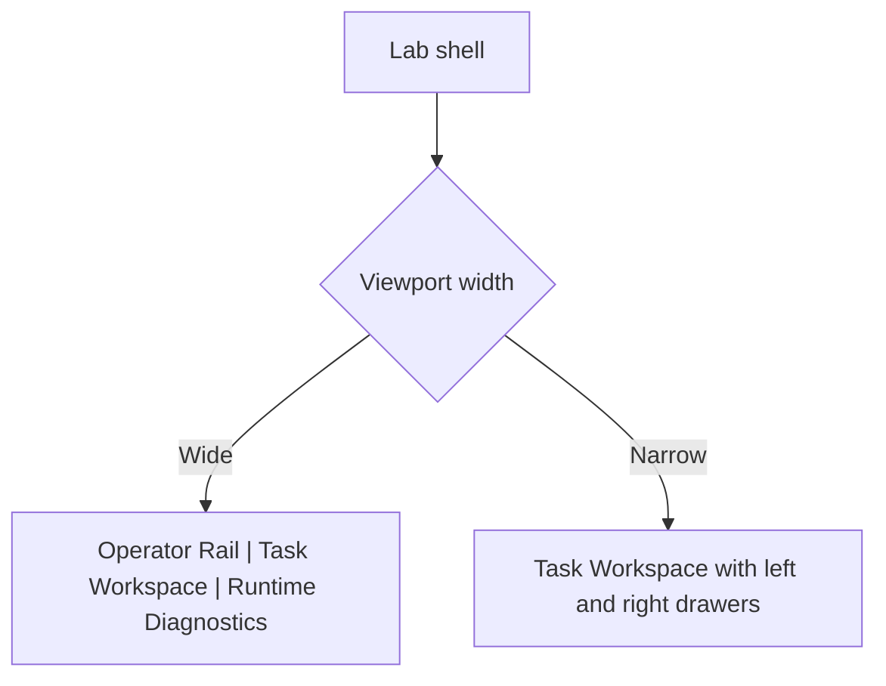
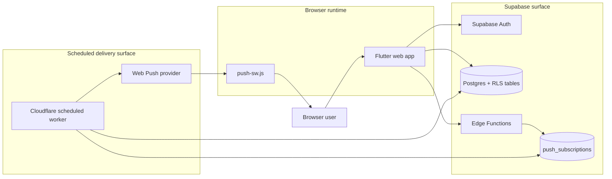
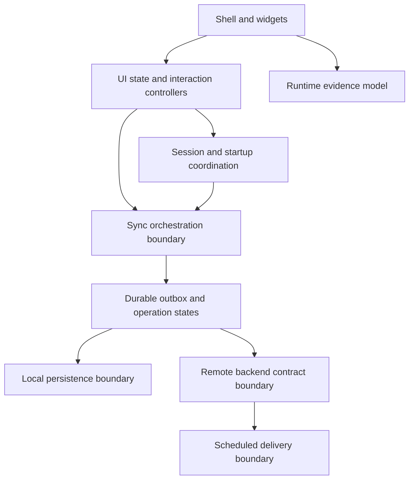

# SaaS Reliability Lab

A web-first reliability lab built around a small task domain so sync, auth, push, and offline behavior can be observed directly in the product UI.

This repository is organized around a reliability-lab workspace with a durable operator shell and live runtime diagnostics.

The task domain is still useful, but it is no longer the point.
The point is to study what breaks, what recovers, and what remains visible when a small SaaS starts operating under imperfect conditions.

## What exists today

- Flutter Web PWA with a three-pane lab shell:
  - Operator Rail
  - Task Workspace
  - Runtime Diagnostics
- Local-first task CRUD with SharedPreferences persistence
- Supabase authentication and per-user task sync
- Runtime diagnostics state for connectivity, auth, sync, push, and local task counts
- Operator-rail fault injection for controlled connectivity-loss and delayed-sync experiments
- Browser push registration for signed-in profiles
- Scheduled notification dispatch through a Cloudflare Worker
- Anonymous-to-authenticated task adoption or discard flow
- Deletion lifecycle fix: local-only anonymous deletes are purged immediately, while account-backed deletes stay tombstoned only until sync confirms the remote delete

## What this repository is trying to achieve

The current shell transformation is the foundation, not the finish line.

The next major goals are:

- strengthen the explicit client-side outbox into a stronger end-to-end sync contract
- surface conflict and blocked-sync states as first-class UI states
- expand fault-injection controls beyond connectivity loss and delayed sync
- strengthen observability beyond the in-app runtime panel
- grow automated coverage for reliability-critical paths

## Current UI shape

The app now opens into a lab-style workspace rather than a single centered task screen.
On wide layouts, the center pane is intentionally width-limited and organized as a desktop task canvas rather than a full-width stretched list.

### Operator Rail

- session and auth actions
- manual sync trigger
- persistent task filters
- anonymous-task review controls
- live scenario controls for connectivity loss and delayed sync, plus planned space for the next fault-injection scenarios

### Task Workspace

- bounded desktop-first canvas instead of a full-width stretched task list
- queue controls for search, scope, counts, and local session notices
- dedicated task queue for browsing and selecting tasks
- persistent task inspector for selected-task details and actions
- scrollable attached details and batch panels on narrower widths

### Runtime Diagnostics

- connectivity and sync lifecycle state
- explicit last success, skip, partial, and failure outcomes
- session truth versus cached identity
- local dirty, deleted, and anonymous counts
- push permission and subscription state
- recent runtime event timeline with revealable task-level details and state diffs
- reserved placeholders for future queued, sending, acknowledged, failed, and conflict operation states

On narrow screens, the rails move into drawers so observability remains accessible without reintroducing the old centered layout as the primary model.

## Current system model

The current system model reads more cleanly when it stays separate from the UI shell illustration above.
At the highest level, the implemented system is three linked surfaces: browser runtime, Supabase, and the independently deployable notify worker.

Important current constraint:

The client-side sync model is now explicitly outbox-driven, but the backend mutation surface is still direct `tasks` table CRUD rather than a server-owned mutation gateway.
That means the repository already exposes a real client-side outbox and conflict model while still treating stronger backend ownership, stronger durability, and fuller archive lifecycle semantics as later work.

For the detailed runtime seams inside the Flutter app, use [`ARCHITECTURE.md`](ARCHITECTURE.md).

## Planned evolution at a glance

The repository is already shaping the UI around deeper reliability control, but the target boundary model is still planned work.

That target shape is described in more detail in [`ARCHITECTURE.md`](ARCHITECTURE.md), the archived Objective 0 record in [`archive/OBJECTIVE_0_FOUNDATION_PLAN.md`](archive/OBJECTIVE_0_FOUNDATION_PLAN.md), and the active next-phase plan in [`phases/OBJECTIVE_1_OUTBOX.md`](phases/OBJECTIVE_1_OUTBOX.md).

## Current status

### Implemented now

- the new lab shell is the active root UI
- `TaskWorkspace` is the canonical center pane and now uses a bounded master/detail layout
- `TaskList` remains only as a compatibility wrapper
- runtime state is modeled explicitly through `RuntimeDebugProvider` and `RuntimeDebugState`
- the client now routes workspace interaction state, session flow, sync entry, local snapshot handling, and task mutation rules through dedicated seams around `TaskWorkspace` and `AgendaProvider`
- the client now replays an explicit local outbox with per-operation queued, sending, acknowledged, failed, conflict, blocked-review, and blocked-session states
- diagnostics now expose first-slice conflict resolution actions alongside retained acknowledgement evidence, while the operator rail owns demo-safe reset controls
- sync, auth, connectivity, local counts, and push state are visible in the UI
- push notifications work end to end for signed-in browser profiles

### Still missing

- broader fault-injection controls beyond connectivity loss and delayed sync
- stronger local durability than SharedPreferences
- stronger structured logging and metrics
- broad automated coverage across multi-device and failure scenarios

## Why this exists

Small SaaS systems usually do not fail first because of raw traffic volume.
They fail because state stops lining up cleanly across clients, auth sessions, background jobs, and notifications.

This repository exists to explore those situations before they show up in production:

- users creating work offline and reconnecting later
- cached identity diverging from actual auth state
- delayed or skipped sync attempts
- multiple browser profiles receiving the same notification
- scheduled backend behavior operating independently from the client

The goal is not to build a broad productivity product.
The goal is to make reliability behavior inspectable.

## Docs index

This page is the main index for the repository's long-form docs.
Use the links below based on what you are trying to understand today, then drill into the purpose-based folders only when you need deeper implementation context.

- [`../README.md`](../README.md): root visitor-facing overview and monorepo entry point
- [`GITHUB_AUTOMATION.md`](GITHUB_AUTOMATION.md): repository automation surface, workflows, and deployment-related GitHub Actions context
- [`../flutter-app/README.md`](../flutter-app/README.md): Flutter client overview, local run commands, runtime config, and app-specific concerns
- [`../notify-worker/README.md`](../notify-worker/README.md): Cloudflare Worker purpose, local commands, runtime expectations, and delivery concerns
- [`../supabase/README.md`](../supabase/README.md): backend surface, local Supabase workflow, functions, migrations, and backend-specific concerns
- [`ARCHITECTURE.md`](ARCHITECTURE.md): implemented topology, state ownership, and evolution path
- [`DEPLOYMENT.md`](DEPLOYMENT.md): GitHub Actions workflows, GitHub Pages integration, worker deployment, and environment matrix
- [`TESTING_STRATEGY.md`](TESTING_STRATEGY.md): repo-wide testing contract, current suite inventory, target test taxonomy, and the direction for CI verification and refactoring
- [`guides/STATE_MODELS.md`](guides/STATE_MODELS.md): dedicated outbox, sync-run, and auth/session state-machine reference plus current known mismatches
- [`phases/OBJECTIVE_1_OUTBOX.md`](phases/OBJECTIVE_1_OUTBOX.md): single active Objective 1 plan for the explicit outbox phase
- [`guides/FAULT_INJECTION.md`](guides/FAULT_INJECTION.md): implemented and planned fault-injection behavior, including delayed-sync guidance
- [`guides/RESPONSIVE_DESIGN.md`](guides/RESPONSIVE_DESIGN.md): single responsive contract for the shell and task workspace
- [`guides/EXPERIMENTS.md`](guides/EXPERIMENTS.md): runnable and planned reliability scenarios
- [`guides/TASK_DELETION_LIFECYCLE.md`](guides/TASK_DELETION_LIFECYCLE.md): current delete semantics and future archive direction
- [`future/TRY_THE_LAB_PLAN.md`](future/TRY_THE_LAB_PLAN.md): planned public-sandbox auth path for low-friction exploration without exposing shared credentials in the client
- [`future/SERVER_OWNED_MUTATION_BOUNDARY_PLAN.md`](future/SERVER_OWNED_MUTATION_BOUNDARY_PLAN.md): future-state sketch for moving task mutation replay from direct client CRUD to a server-owned mutation gateway
- [`future/TASK_QUEUE_ACTIONS_PLAN.md`](future/TASK_QUEUE_ACTIONS_PLAN.md): future queue-action and explicit batch-action direction
- [`future/reliability_lab_checklist.md`](future/reliability_lab_checklist.md): milestone checklist for turning the prototype into a stronger lab
- [`archive/OBJECTIVE_0_FOUNDATION_PLAN.md`](archive/OBJECTIVE_0_FOUNDATION_PLAN.md): completed Objective 0 execution record and handoff for the finished foundation refactor
- [`archive/project_analysis.md`](archive/project_analysis.md): historical current-state analysis captured after the shell transformation
- [`LOCAL_DEVELOPMENT.md`](LOCAL_DEVELOPMENT.md): repository-root workflow, local commands, and developer setup for running the projects locally
- [`AI_ASSISTED_DEVELOPMENT.md`](AI_ASSISTED_DEVELOPMENT.md): intended human-and-agent development loop, Copilot workflow, and low-friction lifecycle expectations
- `.tmp/ui_lab_redesign_plan.md`: local execution tracker for the UI redesign work

## Working with this folder

This directory is the long-form explanation layer for the repository.
Use the root README and subproject READMEs as entry points, then use the documents here when you need deeper product, architecture, deployment, or testing context.

Use the purpose-based folders to avoid mixing live plans with historical or future-only notes:

- `phases/` for the active implementation phase
- `guides/` for operator- and behavior-focused deep dives
- `future/` for forward-looking plans that are not active implementation contracts
- `archive/` for historical records kept for context

When code changes affect behavior, the docs here should stay aligned with:

- the actual runtime behavior in `flutter-app\`, `notify-worker\`, and `supabase\`
- the repository-root local workflow in `LOCAL_DEVELOPMENT.md`
- the operator framing of the project as a reliability lab rather than a generic task app

## Tech stack

Client:

- Flutter
- Dart
- SharedPreferences local persistence
- Provider state management

Backend and delivery:

- Supabase Auth
- Supabase Postgres
- Supabase Edge Functions
- GitHub Actions for frontend and worker deployment
- GitHub Pages for the public web build
- Cloudflare Worker for scheduled notification dispatch
- Web Push + browser service worker runtime

## Current framing

This project should now be read as a reliability lab with a task domain, not as a task app with reliability-themed notes.

That distinction matters because the next engineering steps are not more CRUD polish.
They are explicit sync semantics, conflict visibility, and controlled experiment execution.
