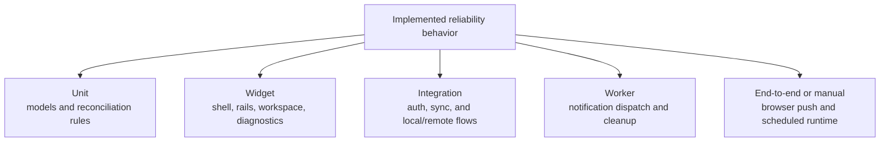

# Testing Strategy - SaaS Reliability Lab

## Purpose

This document defines how automated and manual testing should work across the repository.

The project is a reliability lab, so testing is not just a quality checkbox.
It is part of the product contract:

- reliability claims in docs should be backed by executable coverage
- regressions should fail in automation before they are rediscovered manually
- each major reliability surface should have an intentional test layer

## Why this matters here

This repository studies what happens when state stops lining up cleanly across:

- local storage
- authenticated session state
- cloud reconciliation
- background notification delivery
- browser runtime behavior

Those are exactly the kinds of flows that tend to look fine in happy-path demos and then break under real transitions.
That makes test structure especially important.

## Current test surface

### Flutter app

Current files:

- `flutter-app\test\sync_logic_test.dart`
- `flutter-app\test\agenda_provider_test.dart`
- `flutter-app\test\task_local_state_coordinator_test.dart`
- `flutter-app\test\task_list_state_coordinator_test.dart`
- `flutter-app\test\task_sync_flow_coordinator_test.dart`
- `flutter-app\test\task_local_snapshot_coordinator_test.dart`
- `flutter-app\test\task_mutation_coordinator_test.dart`
- `flutter-app\test\task_sync_coordinator_test.dart`
- `flutter-app\test\task_workspace_interaction_controller_test.dart`
- `flutter-app\test\workspace_session_coordinator_test.dart`
- `flutter-app\test\lab_shell_test.dart`
- `flutter-app\test\lab_left_rail_test.dart`
- `flutter-app\test\sync_debug_panel_test.dart`
- `flutter-app\test\task_workspace_test.dart`
- `flutter-app\test\task_workspace_responsive_test.dart`
- `flutter-app\test\test_support\app_test_support.dart`

What they currently cover:

- sync reconciliation rules
- connectivity-loss fault injection at the sync boundary
- delayed-sync fault injection at the sync boundary
- anonymous-task adoption and deletion behavior
- provider-facing task-list persistence and debug-count publication
- provider-facing sync sequencing for anonymous-task keep/discard flows
- local snapshot pruning and snapshot persistence helpers
- task-mutation rules for completion, deletion, and anonymous-task adoption
- sync gating and post-sync reload orchestration
- workspace interaction rules for selection, batch mode, and view-state pruning
- workspace startup and auth-session orchestration
- shell ownership across wide and narrow layouts
- operator rail rendering for anonymous and authenticated states
- diagnostics rail rendering for explicit sync, push, local-state, and timeline evidence, including revealable event-record details and a timeline-only clear action
- diagnostics rail rendering for active fault-injection evidence
- provider-level queue and batch behavior
- workflow-style widget regressions in the task workspace
- responsive widget behavior at fixed viewport sizes, including wide-layout rail and split-pane scroll affordances

Current issue:

The Flutter coverage is now structured more honestly by concern, but it still needs broader integration coverage and deeper multi-step reliability scenarios.

### Notify worker

Current files:

- `notify-worker\test\dispatch.spec.ts`
- `notify-worker\test\cleanup.spec.ts`
- `notify-worker\test\test-support\notify-worker-test-support.ts`

What they currently cover:

- successful notification dispatch
- no-op behavior when nothing is pending
- stale-subscription cleanup when the push provider returns `410`

Current issue:

The worker suite is valid but too narrow and not yet structured for a broader reliability matrix.

### CI

Current state:

- a dedicated GitHub Actions verification workflow now runs repository tests separately from deployment
- deploy workflows exist for the frontend and worker
- verification currently runs Flutter tests and worker tests
- schema or backend validation is still a future addition rather than part of the current CI contract

## Current Test Coverage Status

### Covered now

- Flutter sync reconciliation logic
- Flutter agenda-provider behavior for anonymous-task review, deletion semantics, batch selection, and queue sorting
- Flutter provider-facing task-list state persistence and diagnostics-count publication
- Flutter provider-facing sync sequencing for persisted mutation results and anonymous-task keep/discard paths
- Flutter shell ownership and direct rail rendering coverage
- Flutter task-workspace workflow regressions
- Flutter task-workspace responsive behavior at fixed viewport sizes
- worker dispatch success, empty-run behavior, and stale-subscription cleanup
- CI verification for Flutter and worker test suites

### Partially covered

- responsive behavior is covered at fixed sizes, but resize-in-place transitions still need broader automation
- Flutter widget coverage now directly covers `LabShell`, `LabLeftRail`, and `SyncDebugPanel`, but still leans heavier on rendering than on broader multi-step flows
- worker reliability coverage exists, but does not yet cover richer failure matrices or multi-subscription fan-out

### Not yet covered well enough

- offline create -> reconnect -> sync integration paths
- auth/session divergence behavior
- multi-device and multi-profile scenarios
- future outbox semantics, conflict capture, and conflict resolution
- schema or backend-contract validation in CI
- real end-to-end verification for deployed push and scheduled-runtime behavior

## Objective 1 state-machine coverage

Objective 1 now uses a real outbox state machine rather than only extending the older task-diff sync logic.

That means the repo should test two related but distinct concerns:

- the per-entry outbox state machine
- the higher-level sync-run phase machine shown in runtime diagnostics

### Outbox entry state-machine coverage

The first Objective 1 slice now verifies these transition points directly, while broader multi-device and backend-contract scenarios remain later coverage work:

- explicit local-state initialization with an empty outbox when no replayable entries exist yet
- anonymous local work migration into `blockedAnonymousReview`
- `blockedAnonymousReview -> queued` on keep after sign-in
- `blockedAnonymousReview -> removed` on discard
- `blockedNoSession -> queued` when a valid session returns
- `queued -> sending -> acknowledged` on successful replay
- `queued -> sending -> failed` on recoverable replay failure
- `queued -> sending -> conflict` on remote-version mismatch or expected-row-missing cases
- `failed -> queued` on retry
- `conflict -> queued` on reapply-local resolution
- `conflict -> removed` on keep-remote resolution
- delayed-sync placement at local, transport, and backend acknowledgement seams

Implemented focused coverage in the current repo includes:

- local-state initialization and persistence repair checks in `task_local_state_coordinator_test.dart`
- mutation compaction checks in `task_mutation_coordinator_test.dart`
- outbox replay acknowledgement, blocked-session, conflict-path, and delayed-sync seam checks in `sync_logic_test.dart`
- outbox replay acknowledgement, blocked-session, conflict-path, delayed-sync seam checks, replay-input refresh after full-pass delay, and preserve-and-requeue behavior for newer mid-pass local mutations in `sync_logic_test.dart`
- diagnostics evidence rendering, delayed-sync configuration visibility, and conflict-action coverage in `sync_debug_panel_test.dart`, with operator-rail modal configuration and soft-reset confirmation coverage in `lab_left_rail_test.dart`
- hard-reset remote-delete replay and local wipe coverage in `agenda_provider_test.dart`
- local-state conflict resolution coverage in `task_local_state_coordinator_test.dart` and signed-out workspace clearing coverage in `workspace_session_coordinator_test.dart`
- mutation-to-persistence handoff checks in `task_sync_flow_coordinator_test.dart`

### Sync-run phase coverage

The first Objective 1 slice should also verify the higher-level runtime phases:

- `initialLoad` during startup restore and migration
- `idle` once local state settles
- `offline` when replay is requested without connectivity
- `blockedNoSession` when replay is requested without a live session
- `blockedAnonymousReview` when anonymous review gates replay
- `syncing` while replay is active
- partial or failed outcome evidence when the run does not settle cleanly

This coverage matters because the outbox is not only a storage concern.
It is the behavior contract that makes the reliability lab observable and explainable.

## Testing principles

### 1. Test by reliability concern, not by leftover default filenames

Test files should be named after the behavior they protect.
The repo should avoid keeping domain, provider, widget, and responsive assertions mixed together under generic names like `widget_test.dart`.

### 2. Prefer the smallest layer that can prove the behavior honestly

- use unit tests for pure model and orchestration logic
- use widget tests for shell, queue, rail, and responsive behavior
- use integration tests for multi-step app flows and runtime transitions
- use worker tests for backend notification behavior
- use manual experiments only when automation is not yet practical or when the scenario depends on external runtime infrastructure

### 3. Reliability scenarios need visible evidence and executable proof

For important scenarios, the repo should eventually have both:

- user-visible or operator-visible evidence in the product
- automated coverage that protects the behavior from regression

### 4. Refactors should separate structure before widening coverage

The first step is to make the current suites legible and maintainable.
After that, adding deeper coverage becomes safer and faster.

## Test taxonomy for this repo

| Layer             | Primary concern                                                        | Examples in this repo                                                                         |
| ----------------- | ---------------------------------------------------------------------- | --------------------------------------------------------------------------------------------- |
| Unit              | pure logic, model behavior, reconciliation rules                       | `TaskModel`, task ordering, sync merge rules, session helpers                                 |
| Widget            | render behavior, interaction flows, responsive layout, shell ownership | `LabShell`, `TaskWorkspace`, `LabLeftRail`, `SyncDebugPanel`                                  |
| Integration       | multi-step app flows inside Flutter runtime                            | anonymous create -> login review, offline create -> reconnect -> sync                         |
| Worker            | notification dispatch logic and repository interactions                | stale subscription cleanup, successful send, partial send failure, multi-subscription fan-out |
| End-to-end        | real deployed or near-real infrastructure behavior                     | push registration, scheduled dispatch, multi-profile delivery                                 |
| Manual experiment | exploratory or operational scenarios not yet automated                 | auth churn, external provider behavior, deployed cron timing verification                     |

## What should be tested where

### Flutter unit and orchestration tests

These should protect:

- task reconciliation rules
- anonymous-task adoption and discard rules
- delete semantics for anonymous vs authenticated tasks
- batch-selection and queue filtering logic
- sort and view-state logic

These tests should avoid pumping widgets unless rendering is part of the contract.

### Flutter widget tests

These should protect:

- shell ownership across wide vs narrow layouts
- workspace split vs compact layout
- queue controls, notices, and empty states
- operator rail, task workspace split panes, and diagnostics rail rendering, including wide-layout scrollbar affordances
- task selection, inspector visibility, and batch-action affordances
- responsive transitions, especially resize-in-place behavior

### Flutter integration tests

These should protect:

- offline create -> reconnect -> sync
- auth transition effects on local state and startup recovery
- anonymous local work -> sign in -> keep or discard decision flow
- future conflict and outbox flows once those semantics exist

### Worker tests

These should protect:

- successful notification send
- stale subscription cleanup
- partial send failures
- no-op runs when nothing is pending
- multiple active subscriptions for the same user

### End-to-end and manual verification

Some behavior still needs either deployed verification or manual experiments:

- real browser push subscription lifecycle
- service-worker registration behavior in production
- scheduled cron timing through Cloudflare
- real multi-profile delivery on deployed infrastructure

Those scenarios should still be documented in `EXPERIMENTS.md`, but the repo should keep shrinking the manual-only surface over time.

## Current refactor direction

### Flutter app

The current Flutter suites should be reorganized by concern.

Recommended direction:

- `flutter-app\test\sync_logic_test.dart`
- `flutter-app\test\agenda_provider_test.dart`
- `flutter-app\test\task_local_snapshot_coordinator_test.dart`
- `flutter-app\test\task_mutation_coordinator_test.dart`
- `flutter-app\test\task_sync_coordinator_test.dart`
- `flutter-app\test\task_workspace_interaction_controller_test.dart`
- `flutter-app\test\workspace_session_coordinator_test.dart`
- `flutter-app\test\task_workspace_test.dart`
- `flutter-app\test\task_workspace_responsive_test.dart`
- `flutter-app\test\lab_shell_test.dart`
- `flutter-app\test\lab_left_rail_test.dart`
- `flutter-app\test\sync_debug_panel_test.dart`
- `flutter-app\test\test_support\...` for shared fakes, harnesses, and helper utilities

This structure is a target direction, not a requirement to land all at once.

### Notify worker

Recommended direction:

- `notify-worker\test\dispatch.spec.ts`
- `notify-worker\test\cleanup.spec.ts`
- `notify-worker\test\test-support\...`

Again, the goal is clearer ownership before broader coverage.

## Commands

### Current commands

- Flutter all tests: `Push-Location .\flutter-app; flutter test; Pop-Location`
- Flutter responsive-focused suite: `Push-Location .\flutter-app; flutter test test\task_workspace_responsive_test.dart; Pop-Location`
- Worker tests: `Push-Location .\notify-worker; yarn test; Pop-Location`

## CI direction

The repository now has a dedicated verification workflow separate from deploy workflows.

It currently runs:

1. Flutter tests
2. worker tests

It should eventually expand to run:

1. Flutter tests
2. worker tests
3. any schema or backend validation that becomes part of the repo contract

Deploy workflows are no longer the only automated path that exercises repository correctness.

## Coverage priorities

The next high-value additions are:

1. shell-wide responsive resize-in-place tests
2. targeted widget tests for `LabLeftRail`
3. targeted widget tests for `SyncDebugPanel`
4. integration coverage for offline create -> reconnect -> sync
5. auth/session divergence coverage
6. broader worker scenarios beyond stale-subscription cleanup
7. future outbox and conflict coverage when those semantics become real

## Relationship to other docs

- `LOCAL_DEVELOPMENT.md` describes how to run the suites locally
- `guides/STATE_MODELS.md` documents the current outbox, sync-run, and auth/session state machines
- `guides/EXPERIMENTS.md` defines the behavior and evidence the lab aims to demonstrate
- `guides/RESPONSIVE_DESIGN.md` defines the responsive contract and its required automation strategy
- `future/reliability_lab_checklist.md` tracks the larger milestone path for turning the prototype into a stronger lab
