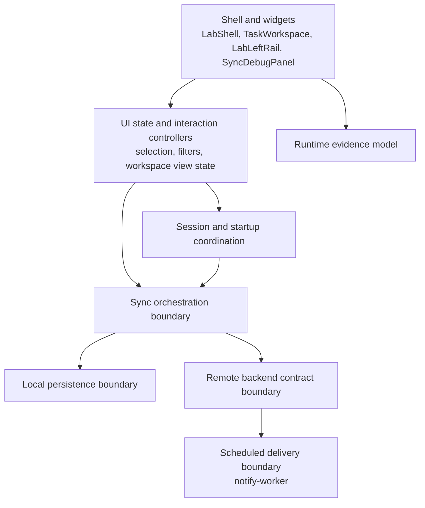

# Objective 0 Foundation Execution Plan

## Purpose

This document is now the completed **Objective 0** execution record and handoff point from `ROADMAP.md`.

The goal was not another shell redesign.
The goal was to make the current reliability-lab shell rest on cleaner boundaries before the repository commits to durable outbox, conflict, observability, and fault-injection work.

## How to use this document

This is no longer a live tracker.

Use it for:

- the completed Objective 0 status
- the final boundary decisions and accepted transitional concerns
- the verification snapshot used to close Objective 0
- the handoff into Objective 1

Do **not** use this file for new active planning. Do **not** duplicate the historical Objective 0 closeout in:

- `ROADMAP.md`
- `README.md`
- `docs/README.md`
- workflow docs or subproject READMEs

Those docs should describe the current architecture honestly, but active next-phase planning now belongs in `docs/phases/OBJECTIVE_1_OUTBOX.md`.

## Implemented baseline

Today the repository already has the right **product shape**, but not yet the right **structural shape** for the next reliability phases.

### Flutter app

Implemented now:

- `LabShell` is the active root UI
- `TaskWorkspace` is the canonical center pane
- `LabLeftRail` owns durable operator controls
- `SyncDebugPanel` renders runtime evidence from `RuntimeDebugProvider`
- `AgendaProvider` now has an explicit high-level construction path that depends on coordinators rather than assembling low-level sync and repository services in the production bootstrap
- `TaskSyncService` now sits behind an app-facing sync gateway contract, even though it still performs task-level reconciliation rather than operation-level replay
- local task persistence is now explicitly treated as a task snapshot boundary backed by SharedPreferences rather than as the long-term meaning of local state

### Backend surface

Implemented now:

- Supabase Auth remains the cloud identity source of truth
- task and subscription state live in Supabase tables and RPC-backed paths
- Edge Functions support browser push subscription save and removal flows
- the sync path is still transitional and task-shaped rather than a stable long-term mutation contract

### Scheduled delivery

Implemented now:

- `notify-worker\src\index.ts` is an independently deployable Cloudflare Worker
- the worker polls due notifications, sends web push payloads, marks successful sends, and cleans up stale subscriptions
- the worker is already a separate operational surface and should stay that way

### Repository automation and docs

Implemented now:

- `verify.yaml` is the repository trust workflow
- frontend and worker deploys are separate workflows
- architecture, deployment, testing, and experiment docs already describe the current lab shell honestly

## Why Objective 0 still matters

The shell transformation solved the UI ownership problem.
It did **not** solve the deeper structural problem that several responsibilities are still too entangled:

- UI-facing providers still carry orchestration and persistence concerns
- the current task model still leaks sync-era assumptions that will not scale cleanly into an outbox model
- local persistence is still a coarse snapshot mechanism rather than a foundation for richer local inspection
- sync, runtime evidence, backend boundaries, and notification behavior are documented more clearly than they are structurally separated in code

If the repo adds durable outbox semantics directly on top of those seams, it risks freezing prototype debt into the next architecture.

## Objective 0 status tracker

Update this tracker only when a workstream changes status or exit criteria.
Do not turn every task delivery into a broad doc refresh.

| Workstream                                  | Status    | What is already true                                                                                                                                                                             | What still blocks exit                                                                                                             |
| ------------------------------------------- | --------- | ------------------------------------------------------------------------------------------------------------------------------------------------------------------------------------------------ | ---------------------------------------------------------------------------------------------------------------------------------- |
| Shell ownership and diagnostics foundation  | Completed | `LabShell`, `TaskWorkspace`, `LabLeftRail`, and `SyncDebugPanel` are the active product surfaces                                                                                                 | No further Objective 0 work needed unless shell ownership regresses                                                                |
| First coordination seams                    | Completed | `TaskSyncCoordinator`, `WorkspaceSessionCoordinator`, `TaskLocalSnapshotCoordinator`, `TaskMutationCoordinator`, and `TaskWorkspaceInteractionController` exist and are covered by focused tests | These seams still need to be used as the stable base for the remaining refactor slices                                             |
| Provider ownership cleanup                  | Completed | `AgendaProvider` now depends on explicit task-list state and sync-flow collaborators rather than directly coordinating most persistence and sync sequencing                                      | Accepted Objective 0 residual concern: `userId` and loading remain inside the facade as temporary UI-facing state                  |
| Sync boundary hardening                     | Completed | `TaskSyncService` sits behind `TaskSyncGateway`, `TaskSyncCoordinator` owns sync-entry checks, and provider-facing sync choreography now runs through `TaskSyncFlowCoordinator`                  | The long-term backend mutation surface remains intentionally deferred to Objective 1 and later                                     |
| Local persistence boundary split            | Completed | Local snapshot behavior is wrapped by `TaskLocalSnapshotCoordinator`, and provider-facing persistence flows run through `TaskListStateCoordinator`                                               | SharedPreferences remains the current snapshot implementation by design until Objective 1 or later expands local persistence scope |
| Backend contract clarification              | Completed | The docs distinguish direct `tasks` CRUD, subscription Edge Functions, and worker-facing RPC behavior explicitly                                                                                 | The repository still needs a later deliberate choice for the long-term task mutation surface                                       |
| Scheduled delivery boundary clarification   | Completed | The worker contract is explicitly documented around `get_pending_notifications`, `tasks.notification_sent`, and `push_subscriptions` cleanup                                                     | Delivery audit history and stronger guarantees remain future work, not Objective 0 blockers                                        |
| Objective 0 exit and handoff to Objective 1 | Completed | Objective 0 now has explicit exit criteria, accepted residual concerns, verification follow-through, and an Objective 1 entry document                                                           | No further Objective 0 work is required unless later code changes regress the completed seams                                      |

## Recommended approach

### 1. Keep the visible shell stable

Do not split attention between architectural cleanup and another UI direction change.
Objective 0 should preserve the current shell and refactor beneath it.

### 2. Treat `AgendaProvider` as a temporary facade, not the final architecture

Recommended approach:

- keep the current widget-facing API stable where practical
- continue moving side effects and sequencing behind smaller collaborators
- avoid replacing one monolith with several UI-facing providers at once unless the code proves that necessary

This is the lowest-risk path because it improves structure without forcing a second UI ownership migration.

### 3. Introduce boundaries before introducing semantics

Objective 0 should prepare for outbox work by making sync, persistence, backend, and delivery seams explicit.
It should **not** partially implement queued operations, retry policy, or conflict resolution.

### 4. Keep status tracking here and keep other docs mostly stable

This plan should carry active status.
Other docs should be updated when architecture, workflow, testing scope, or runtime contracts actually change.

### 5. Current execution decisions

Locked for the next Objective 0 slice:

- keep `AgendaProvider` as the single widget-facing provider during Objective 0
- continue provider cleanup by extracting collaborators beneath that facade instead of introducing another UI-facing provider
- keep the next slice frontend-only and leave the long-term backend mutation boundary open until a later documented decision

Locked at Objective 0 closeout:

- keep `userId` and loading inside `AgendaProvider` as accepted temporary facade concerns instead of doing one more collaborator extraction
- close Objective 0 with a pragmatic handoff once exit criteria, verification follow-through, and Objective 1 starting conditions are explicit

## Objective 0 exit record

### Accepted transitional concerns at closeout

- `AgendaProvider` still owns `userId` and loading as temporary widget-facing convenience state
- task sync is still task-based reconciliation behind `TaskSyncGateway`, not a durable outbox contract
- SharedPreferences remains the task snapshot store implementation
- notification delivery still records a sent flag and cleanup behavior, not full attempt history or a stronger guarantee model

### Why Objective 0 is considered complete

- the visible shell stayed stable while the underlying seams became less entangled
- provider-facing persistence and sync sequencing now sit behind explicit collaborators
- sync, backend, local persistence, and scheduled delivery boundaries are documented honestly enough for the next phase
- the remaining open decisions are now explicit handoff items instead of hidden architectural coupling

### Verification snapshot at closeout

- Flutter app verification passed with `Push-Location .\flutter-app; flutter test; Pop-Location`
- notify worker verification passed with `Push-Location .\notify-worker; yarn test; Pop-Location`
- docs, roadmap, and index references were updated so Objective 0 no longer points at a stale live tracker

### Objective 1 starting conditions

Objective 1 starts from these boundaries now being present:

- `AgendaProvider` remains the single widget-facing task facade
- `TaskWorkspaceInteractionController` owns interaction/view-state rules
- `TaskMutationCoordinator` owns task mutation rules
- `TaskListStateCoordinator` owns provider-facing snapshot persistence and task-count publication
- `TaskSyncFlowCoordinator` owns provider-facing sync sequencing for persisted mutations and anonymous-task keep/discard flows
- `TaskSyncCoordinator` owns sync-entry checks and post-sync reload behavior
- `TaskSyncGateway` defines the current app-facing sync contract, with `TaskSyncService` as the transitional implementation

Objective 1 should build on those seams rather than reopen Objective 0 structure work unless a regression appears.

## Keep, replace, defer matrix

| Area                           | Current role                          | Objective 0 action                                   | Reason                                                                                              |
| ------------------------------ | ------------------------------------- | ---------------------------------------------------- | --------------------------------------------------------------------------------------------------- |
| `LabShell`                     | root responsive shell                 | Keep                                                 | The visible shell direction is already correct                                                      |
| `TaskWorkspace`                | canonical center pane                 | Keep                                                 | Objective 0 is not another workspace redesign                                                       |
| `LabLeftRail`                  | durable operator controls             | Keep                                                 | It is the right home for future reliability controls                                                |
| `SyncDebugPanel`               | runtime evidence surface              | Keep                                                 | It already reserves space for later operation states                                                |
| `RuntimeDebugProvider`         | UI-facing evidence model              | Keep and decouple                                    | The model is useful, but unrelated layers should publish into it more cleanly                       |
| `AgendaProvider`               | task-facing state and intent facade   | Refactor                                             | It still carries too much orchestration weight                                                      |
| `TaskSyncCoordinator`          | sync entry and reload gating          | Keep and evolve                                      | It is the right seam to stabilize before outbox work                                                |
| `TaskSyncService`              | current task reconciliation engine    | Refactor behind a clearer gateway                    | The implementation can stay transitional, but the app should depend on a more explicit contract     |
| `TaskLocalSnapshotCoordinator` | local snapshot orchestration          | Keep and evolve                                      | It is the right seam for separating snapshot concerns from future local state concerns              |
| `TasksRepository`              | local task snapshot storage           | Retain implementation, replace architectural meaning | SharedPreferences can stay for now, but it should stop looking like the long-term local-state model |
| `WorkspaceSessionCoordinator`  | startup and auth-session coordination | Keep and evolve                                      | It already moves startup logic out of widgets                                                       |
| Supabase task RPC and reads    | current backend surface               | Clarify and partially abstract                       | The long-term sync contract is still open                                                           |
| `notify-worker`                | scheduled delivery boundary           | Keep and clarify                                     | Operational independence should remain intact                                                       |

## Target boundary map

This is intentionally a boundary map, not a promise of exact class names.
The important change is to move from convenience-heavy seams toward application boundaries that can survive Objective 1.

## Execution sequence

### Phase 1 - Freeze the boundary contract and exit criteria

Goal:

- agree on what Objective 0 is preserving, replacing, and deferring before more code churn begins

Primary surfaces:

- `docs/ARCHITECTURE.md`
- `docs/archive/project_analysis.md`
- `ROADMAP.md`
- this document

Detailed implementation steps:

1. Lock the keep, replace, defer decisions for the current app layers.
2. Confirm the target boundary map used by the Flutter app, backend surface, and notify worker.
3. Write down the Objective 0 exit criteria in terms of architecture and verification, not just file movement.
4. Keep the long-term sync gateway decision open, but stop treating that uncertainty as permission for fuzzy app boundaries.

Exit criteria:

- this document reflects the active workstreams and exit conditions
- `ROADMAP.md` still describes Objective 0 accurately at the roadmap level
- `docs/ARCHITECTURE.md` and `docs/archive/project_analysis.md` describe the current implemented seams honestly

### Phase 2 - Contract `AgendaProvider` into a narrower task-facing facade

Goal:

- keep the existing widget-facing behavior while reducing architectural weight in `AgendaProvider`

Primary surfaces:

- `flutter-app/lib/providers/agenda_provider.dart`
- `flutter-app/lib/services/`
- `flutter-app/lib/controllers/`
- `flutter-app/lib/widgets/lab/task_workspace.dart`

Recommended implementation steps:

1. Keep `AgendaProvider` as the current UI facade so widgets do not need a large migration during Objective 0.
2. Move task-list sequencing concerns out of the provider in the next bounded slice.
3. Separate these responsibilities explicitly:
   - in-memory task collection updates
   - persistence sequencing
   - sync trigger sequencing
   - debug-state publication
4. Keep selection, filtering, and batch interactions attached to the existing interaction-controller seam instead of growing new widget-owned logic.
5. Make the provider's public API read more like user intents and view state than infrastructure choreography.

Recommended result:

- widgets still depend on one main task-facing facade
- orchestration is no longer mostly encoded inside provider private methods
- Objective 1 can add outbox-facing state without first untangling a monolithic provider

Exit criteria:

- `AgendaProvider` no longer directly coordinates most persistence and sync sequencing
- task mutation and interaction rules remain outside the provider
- `TaskWorkspace` and `LabLeftRail` behavior stays the same from the user perspective

### Phase 3 - Harden the sync boundary without implementing the outbox

Goal:

- preserve the current sync behavior while making the app depend on a clearer sync contract

Primary surfaces:

- `flutter-app/lib/services/task_sync_service.dart`
- `flutter-app/lib/services/task_sync_coordinator.dart`
- `flutter-app/lib/repositories/`
- `flutter-app/lib/providers/runtime_debug_provider.dart`

Recommended implementation steps:

1. Introduce an explicit app-facing sync gateway contract above the current task reconciliation engine.
2. Keep the current task-shaped implementation behind that contract during Objective 0.
3. Normalize sync outcomes into a clearer result shape so later operation-based work can plug into the same high-level boundary.
4. Reduce direct task-shaped assumptions leaking into unrelated layers.
5. Keep runtime diagnostics wired to explicit sync outcomes, but avoid letting diagnostics concerns dictate the domain shape.

Important constraint:

Objective 0 prepares the boundary.
It does **not** add durable mutation replay, per-operation ids, retry queues, or conflict resolution.

Exit criteria:

- the app can depend on a sync boundary without depending on `TaskSyncService` details
- the current reconciliation engine remains replaceable
- runtime diagnostics still show honest current-state evidence

### Phase 4 - Split local persistence meaning before changing storage technology

Goal:

- keep SharedPreferences for now, but stop treating the snapshot store as the long-term local-state model

Primary surfaces:

- `flutter-app/lib/repositories/tasks_repository.dart`
- `flutter-app/lib/services/task_local_snapshot_coordinator.dart`
- `flutter-app/lib/models/`
- `docs/ARCHITECTURE.md`

Recommended implementation steps:

1. Keep the existing snapshot repository working so the UI and tests stay stable.
2. Clarify in code and docs that the current repository is a task snapshot boundary, not a future operation-log boundary.
3. Separate snapshot responsibilities from future local-state responsibilities at the interface and architecture level.
4. Avoid introducing a heavier local database during Objective 0 unless another task explicitly expands scope.

Exit criteria:

- SharedPreferences remains an implementation detail of the current snapshot boundary
- the architecture no longer implies that task snapshot storage is the final local model
- Objective 1 can add a real outbox without redefining what the current repository already means

### Phase 5 - Clarify the backend contract and scheduled delivery boundary

Goal:

- make the app-side backend contract and the worker's place in the system model explicit enough for later reliability work

Primary surfaces:

- `supabase/migrations/`
- `supabase/functions/`
- `notify-worker/src/index.ts`
- `notify-worker/README.md`
- `docs/ARCHITECTURE.md`
- `docs/DEPLOYMENT.md`
- `supabase/README.md`

Recommended implementation steps:

1. Document what the frontend should currently treat as the sync gateway, even if the long-term decision remains open.
2. Mark current reads and writes as either transitional or intended to survive into later phases.
3. Confirm that backend refactors preserve the worker's pending-notification selection contract.
4. Clarify the worker as a scheduled delivery boundary, not a hidden extension of the frontend.
5. Identify later audit seams that Objective 1 and later objectives will need, such as delivery-attempt history and stronger sync-side evidence.

Exit criteria:

- the notify worker remains independently deployable and independently understandable
- backend docs separate implemented current contracts from planned later contracts
- the app, backend, and worker boundaries read as one coherent system model

### Phase 6 - Expand the minimum verification surface needed to trust the refactor

Goal:

- protect the shell and the new architectural seams from silent regression while Objective 0 is in flight

Primary surfaces:

- `flutter-app/test/`
- `notify-worker/test/`
- `docs/TESTING_STRATEGY.md`

Recommended implementation steps:

1. Keep the current seam-focused unit and orchestration tests green throughout the refactor.
2. Add direct widget coverage for the shell surfaces that now define the product:
   - `LabShell`
   - `LabLeftRail`
   - `SyncDebugPanel`
3. Add at least one integration-style app path for offline create -> reconnect -> sync.
4. Add at least one auth/session divergence path.
5. Expand worker coverage beyond success and stale-subscription cleanup when boundary changes make that practical.

Exit criteria:

- Flutter tests still protect the existing coordination seams
- shell ownership is covered directly, not only through workspace tests
- the worker test surface is still aligned with the actual delivery contract

### Phase 7 - Close Objective 0 cleanly and hand off to Objective 1

Goal:

- finish Objective 0 as a foundation pass instead of drifting into partial outbox work

Detailed implementation steps:

1. Reassess this tracker and mark each workstream honestly.
2. Update architecture and testing docs to match the implemented seams.
3. Confirm that remaining open decisions are now easier to answer rather than more entangled.
4. Write the Objective 1 starting conditions explicitly in terms of boundaries that now exist.

Objective 0 closed with this result:

- the app's visible shell still matches the current lab model
- the current architecture is less entangled than it was at the start of Objective 0
- the next outbox phase can land on intentional seams instead of prototype-era shortcuts

Objective 0 is **not** complete just because files moved around.
The refactor has to make the future system easier to reason about.

## Verification required by this plan

Use the existing repo commands only:

- Flutter app verification: `Push-Location .\flutter-app; flutter test; Pop-Location`
- worker verification: `Push-Location .\notify-worker; yarn test; Pop-Location`

Validation expectations by workstream:

1. provider, service, repository, widget, or sync refactors in `flutter-app/` must keep Flutter tests green
2. worker or worker-facing backend changes must keep worker tests green
3. docs and workflow changes must stay aligned with the actual repo files and commands

## Documentation follow-through

Objective 0 implementation work should update these docs when the underlying behavior or contract changes:

- `docs/ARCHITECTURE.md`
- `docs/archive/project_analysis.md`
- `docs/TESTING_STRATEGY.md` when verification scope changes
- `docs/DEPLOYMENT.md` if workflow or runtime contracts change
- `docs/README.md` only when the repository guide or framing needs updating
- `README.md` only when the repo-level summary materially changes
- `notify-worker/README.md` when delivery behavior or worker boundaries change
- `supabase/README.md` when backend contract expectations change materially

## Open decisions Objective 0 should surface, not prematurely answer

These decisions do not all need to be implemented during Objective 0, but the refactor should make them easier to answer instead of harder:

1. what the long-term sync boundary should be: Supabase RPC, Edge Function, or another backend surface
2. when SharedPreferences should give way to stronger local persistence for a durable outbox
3. how conflict policy should eventually work: reject, merge, or explicit user resolution
4. what notification guarantee the lab wants to model over time: best-effort, at-least-once, or at-most-once

## Scope boundaries

Implement in Objective 0:

- responsibility cleanup
- clearer boundary definitions
- provider, service, and repository refactors
- documented current-versus-target architecture
- backend and worker contract cleanup that preserves current behavior
- stronger test coverage for the existing shell and seam ownership

Do not treat as part of Objective 0 unless scope is explicitly expanded later:

- full durable outbox implementation
- conflict resolution workflow
- fault injection features
- stronger local database replacement
- CI/CD orchestration redesign beyond documenting the current trust model
- new product-surface expansion unrelated to reliability semantics

## Retiring this document

Objective 0 is complete, so this file no longer acts as a live tracker.

For this repository, the chosen closeout path is:

- keep this file as the historical Objective 0 execution record and handoff
- move active next-phase planning to `docs/phases/OBJECTIVE_1_OUTBOX.md`

Do not restart active tracking here unless the repository intentionally reopens Objective 0 because of a later regression.
