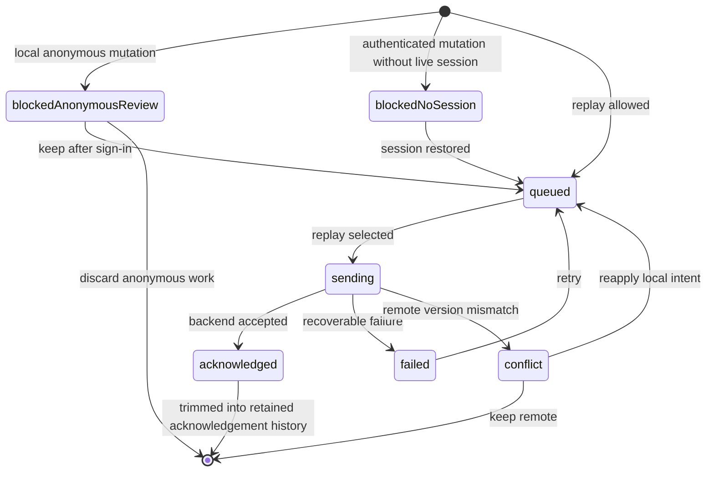
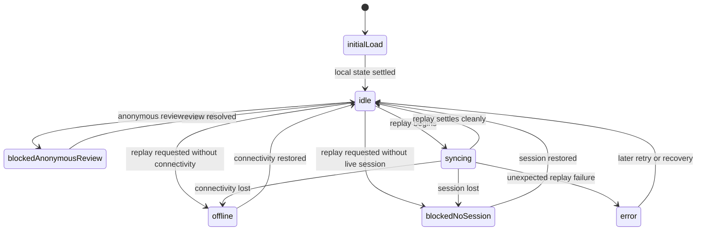
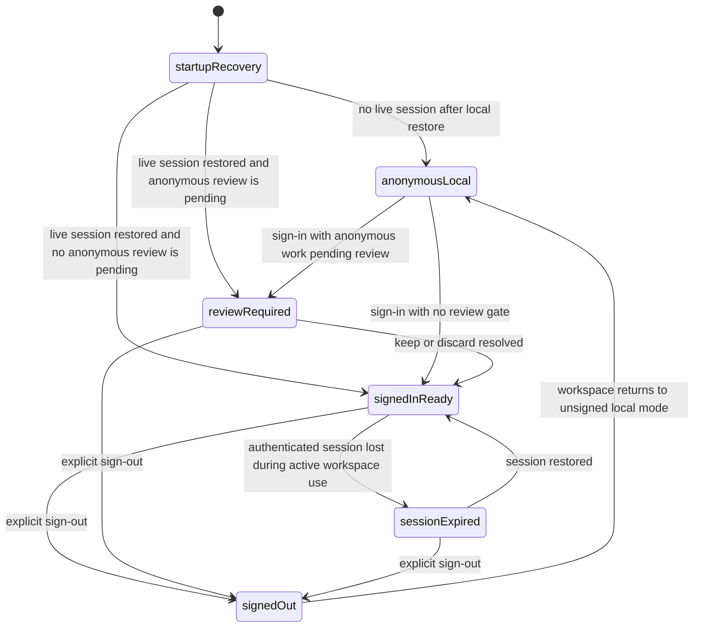

# Reliability State Models

Status: current-state reference

## Purpose

This guide pulls the most important runtime state models out of the broader architecture document so they can stand on their own.

Use this file when you want the current state-machine view of the lab without reading the full topology and ownership narrative in `ARCHITECTURE.md`.

This guide documents implemented behavior and the current documented limits.
It does not define future behavior by itself.

## Current sync state model

The repository now has two related client-side state machines:

1. a per-entry outbox state machine for replayable local work
2. a higher-level sync-run state machine for the runtime phase shown in diagnostics

### Outbox entry state machine

### Sync-run phase machine

## Current auth and session state model

This state model is derived from the currently documented behavior in `WorkspaceSessionCoordinator`, `EXPERIMENTS.md`, and the existing session-coordinator tests.

It focuses on the user-visible session and workspace states, not the internal Supabase SDK event sequence.

### Current auth/session reading

- startup restores cached identity and local task state before authenticated replay proceeds
- Supabase auth remains the source of truth for whether cloud replay is allowed
- anonymous local work can block authenticated replay until the operator explicitly keeps or discards it
- explicit sign-out clears the local authenticated workspace boundary on the current device
- session loss and explicit sign-out are different states: one can recover a replay block, the other intentionally clears the user-bound workspace

## Known mismatches between implementation and aspiration

The repository now documents stronger reliability behavior than it had during the earlier shell-only phase, but some gaps remain explicit.

### 1. Client-side outbox vs backend mutation ownership

Implemented now:

- the client replays an explicit local outbox
- diagnostics expose queued, blocked, failed, conflict, and acknowledgement evidence

Still not true:

- the backend does not yet own mutation replay, idempotency, or acknowledgement receipts
- the task mutation boundary is still direct `tasks` table CRUD rather than a server-owned mutation gateway

### 2. Outbox visibility vs stronger local durability

Implemented now:

- outbox state is persisted locally and restored on startup

Still not true:

- local durability is not yet production-grade or transactional
- SharedPreferences remains the current persistence layer

### 3. Conflict visibility vs richer conflict workflow

Implemented now:

- first-slice conflicts are visible in the runtime diagnostics surface
- operators can keep remote state or re-queue local intent

Still not true:

- there is no field-level merge workflow
- there is no broader multi-device conflict-management model yet

### 4. Fault injection vs broader experiment control

Implemented now:

- connectivity-loss and delayed-sync scenarios exist
- delayed sync already supports client-side `local`, `transport`, and `backend` modes

Still not true:

- broader fault injection such as auth expiry, duplicate replay, and deeper worker-side scenarios is not yet implemented

### 5. In-app diagnostics vs full observability

Implemented now:

- the UI exposes runtime diagnostics for auth, sync, connectivity, push, local counts, and recent runtime events

Still not true:

- the repo does not yet have strong cross-surface correlation, structured metrics, or richer backend-side audit history

### 6. Focused test coverage vs full reliability coverage

Implemented now:

- the repo has focused Flutter and worker tests around the current state machines and reliability-critical slices

Still not true:

- deeper integration coverage, multi-device scenarios, schema validation, and deployed end-to-end verification remain incomplete

## Related docs

- [`../ARCHITECTURE.md`](../ARCHITECTURE.md)
- [`EXPERIMENTS.md`](EXPERIMENTS.md)
- [`../TESTING_STRATEGY.md`](../TESTING_STRATEGY.md)
- [`../phases/OBJECTIVE_1_OUTBOX.md`](../phases/OBJECTIVE_1_OUTBOX.md)
